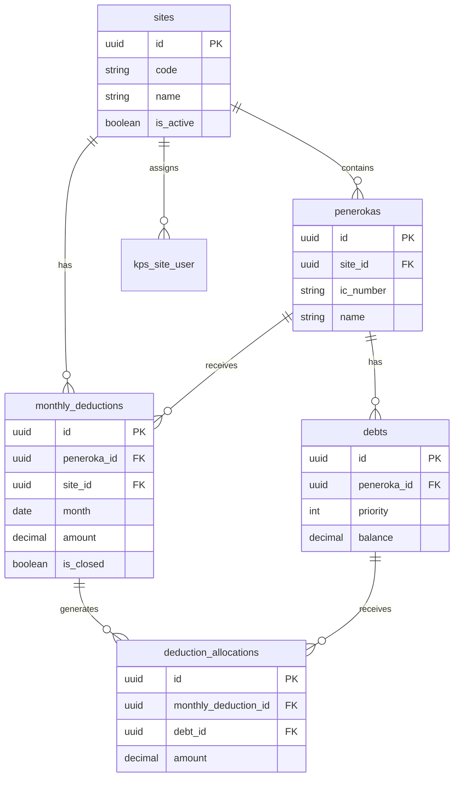

# System Map: KPS

> Technical map of the current KPS application and its moving parts.

**Purpose**: Document the live application structure and how the major pieces connect  
**Intended audience**: Developers, architects, maintainers  
**Last updated**: 2026-04-04  
**Links**: [System Design](../02-architecture/02-system-design.md) | [PRD](../02-architecture/01-prd.md)

## Architecture Layers

```text
Frontend
  Vue 3 + Inertia pages
  KPS layout components
  HQ sidebar and site sidebar
  Shared permission-aware navigation

Application
  Laravel routes under /kps and /admin
  Controllers for dashboard, analytics, sites, peneroka, hutang, potongan, allocations, reports, users, roles
  Middleware for site context and auth

Domain
  AllocationService
  SiteContextResolver
  MonthlyClosingService
  Audit logging

Data
  MySQL tables for sites, penerokas, debts, monthly_deductions, deduction_allocations, kps_site_user, kps_audit_logs
```

## Core Modules

### Frontend

| Component | Purpose | Location |
|-----------|---------|----------|
| HQ sidebar | Global navigation for KPS management | `resources/js/components/kps/KpsMainSidebar.vue` |
| Site sidebar | Site-scoped navigation for operational work | `resources/js/components/kps/KpsSiteSidebar.vue` |
| Dashboard pages | HQ overview and site overview | `resources/js/pages/Kps/**` |
| Report pages | Peneroka statements and report listing | `resources/js/pages/Kps/Reports/**` |

### Backend Controllers

| Controller | Route Area | Purpose |
|-----------|------------|---------|
| DashboardController | `/kps/dashboard` | HQ overview |
| AnalyticsController | `/kps/analytics` | Summary metrics |
| SiteController | `/kps/sites` | Site CRUD |
| PenerokaController | `/kps/sites/{site}/peneroka` | Peneroka CRUD |
| DebtController | `/kps/sites/{site}/hutang` | Debt CRUD |
| MonthlyDeductionController | `/kps/sites/{site}/potongan` | Monthly deduction entry |
| AllocationReviewController | `/kps/sites/{site}/allocations` | Allocation review and month close |
| ReportController | `/kps/sites/{site}/reports` | Report listing and statement views |
| UserManagementController | `/admin/users` | User administration |
| RoleManagementController | `/admin/roles` | Role administration |

### Domain Services

| Service | Responsibility |
|---------|---------------|
| AllocationService | Applies the deduction waterfall in priority order and updates balances |
| SiteContextResolver | Resolves the active site for the current user and route |
| MonthlyClosingService | Closes a site month and blocks further edits |

## Access Model

Current application roles:

- `pentadbiran`
- `company_admin`
- `site_admin`
- `staff`

The frontend navigation is permission aware, and site-scoped routes are protected by auth plus the KPS site context middleware.

## Database Schema



## Data Flow

1. A site user enters or edits a monthly potongan.
2. The deduction record is stored for the selected site and peneroka.
3. AllocationService distributes the amount across debts in priority order.
4. Allocation rows are written and debt balances are updated.
5. Any leftover amount remains unallocated.
6. Month closing marks the site period as locked.
7. Audit actions are recorded for traceability.

## Integration Points

- Authentication: Laravel auth with Fortify
- Authorization: Spatie Laravel Permission
- Frontend: Vue 3 with Inertia.js
- Build tooling: Vite
- Database: MySQL with migrations and seeders

## Related Documents

- [Development](../03-development/README.md)
- [Deployment](../04-deployment/README.md)
- [User Guide](../05-user-guide/README.md)
