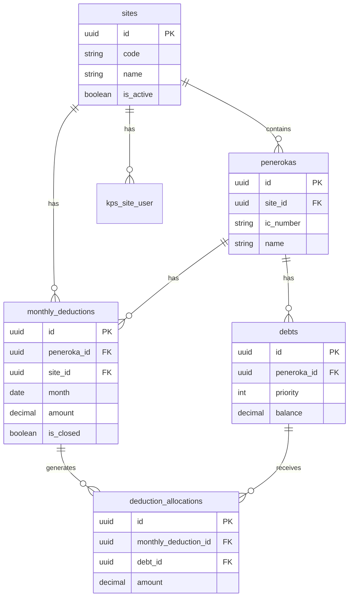

# System Map: KPS

> Technical architecture overview and component relationships.

**Purpose**: Visual and textual map of system components and their interactions  
**Intended audience**: Developers, architects  
**Last updated**: 2026-02-10  
**Links**: [System Design](../02-architecture/02-system-design.md) | [PRD](../02-architecture/01-prd.md)

## Architecture Layers

```
┌─────────────────────────────────────────────────────────────┐
│                      Frontend (React)                        │
│  ┌──────────────┐  ┌──────────────┐  ┌──────────────┐      │
│  │  HQ Sidebar  │  │ Site Sidebar │  │  Components  │      │
│  └──────────────┘  └──────────────┘  └──────────────┘      │
└─────────────────────────────────────────────────────────────┘
                            │
                            ▼
┌─────────────────────────────────────────────────────────────┐
│                   API Layer (Laravel)                        │
│  ┌──────────────────────────────────────────────────────┐  │
│  │  Routes: /kps/*, /kps/sites/{site}/*                 │  │
│  └──────────────────────────────────────────────────────┘  │
│  ┌──────────────────────────────────────────────────────┐  │
│  │  Controllers: Dashboard, Analytics, Site, Peneroka,  │  │
│  │  Debt, MonthlyDeduction, AllocationReview, Report    │  │
│  └──────────────────────────────────────────────────────┘  │
│  ┌──────────────────────────────────────────────────────┐  │
│  │  Middleware: EnsureKpsSiteContext                    │  │
│  └──────────────────────────────────────────────────────┘  │
└─────────────────────────────────────────────────────────────┘
                            │
                            ▼
┌─────────────────────────────────────────────────────────────┐
│                   Domain Services                            │
│  ┌──────────────────────────────────────────────────────┐  │
│  │  • AllocationService (waterfall logic)              │  │
│  │  • SiteContextResolver (site scoping)               │  │
│  │  • MonthlyClosingService (month locking)            │  │
│  └──────────────────────────────────────────────────────┘  │
└─────────────────────────────────────────────────────────────┘
                            │
                            ▼
┌─────────────────────────────────────────────────────────────┐
│                   Database (MySQL)                           │
│  ┌──────────────────────────────────────────────────────┐  │
│  │  KPS Tables:                                         │  │
│  │  • sites                                             │  │
│  │  • penerokas                                         │  │
│  │  • debts                                             │  │
│  │  • monthly_deductions                                │  │
│  │  • deduction_allocations                             │  │
│  │  • kps_site_user (pivot)                             │  │
│  │  • kps_audit_logs                                    │  │
│  └──────────────────────────────────────────────────────┘  │
└─────────────────────────────────────────────────────────────┘
```

## Core Components

### Frontend Components

| Component | Purpose | Location |
|-----------|---------|----------|
| HQ Sidebar | Global navigation (Dashboard, Analytics, Sites) | Layout component |
| Site Sidebar | Site-scoped navigation (Peneroka, Hutang, etc.) | Layout component |
| Site Context | Manages active site selection | State management |

### Backend Controllers

| Controller | Routes | Purpose |
|-----------|--------|---------|
| DashboardController | `/kps/dashboard` | HQ overview |
| AnalyticsController | `/kps/analytics` | HQ analytics |
| SiteController | `/kps/sites` | Site CRUD |
| PenerokaController | `/kps/sites/{site}/peneroka` | Peneroka CRUD |
| DebtController | `/kps/sites/{site}/hutang` | Debt CRUD |
| MonthlyDeductionController | `/kps/sites/{site}/potongan` | Deduction entry |
| AllocationReviewController | `/kps/sites/{site}/allocations` | Allocation review |
| ReportController | `/kps/sites/{site}/reports` | Reporting |

### Domain Services

| Service | Responsibility |
|---------|---------------|
| AllocationService | Priority waterfall ordering, allocation line creation, balance updates |
| SiteContextResolver | Resolves current site from route param or user assignment |
| MonthlyClosingService | Locks site month, prevents edits, audit logging |

### Database Schema



## Data Flow: Allocation Workflow

1. **Entry**: Site staff enters monthly potongan for peneroka
2. **Trigger**: AllocationService automatically runs
3. **Ordering**: Debts sorted by priority ASC, due_date ASC (null last), created_at ASC
4. **Allocation**: Deduction amount distributed to debts in order
5. **Recording**: Allocation lines created, debt balances updated
6. **Remainder**: Unallocated amount stored in `monthly_deductions.unallocated_amount`
7. **Audit**: All actions logged to `kps_audit_logs`

## Integration Points

- **Authentication**: Shared auth system (Laravel Sanctum/Fortify)
- **Permissions**: Spatie Laravel Permission package
- **Frontend**: React with Inertia.js
- **Database**: MySQL with migrations

## Related Documents

- [System Design](../02-architecture/02-system-design.md)
- [PRD](../02-architecture/01-prd.md)

---

**Last Updated**: 2026-02-10
