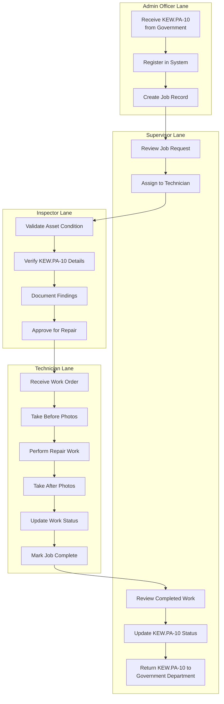

# Workflow Option 1: External KEW.PA-10 Reception

## Overview

This workflow handles KEW.PA-10 forms received from government departments requesting asset repairs or maintenance.

**Primary Users**: Admin Officer, Supervisor, Inspector, Technician

**Entry Point**: KEW.PA-10 form received from external government department

**Exit Point**: Completed repair with updated KEW.PA-10 returned to department

## Workflow Diagram



## Workflow Steps

### 1. Admin Officer: Receive KEW.PA-10

**Role**: Pentadbiran (Admin Officer)

**Actions**:
- Receive physical or digital KEW.PA-10 form from government department
- Verify form completeness and signatures
- Scan/upload KEW.PA-10 documents
- Register KEW.PA-10 number in system

**Required Information**:
- KEW.PA-10 form number
- Requesting department details
- Asset information (ID, type, location)
- Repair request description
- Urgency level
- Budget allocation reference

**System Requirements**:
- KEW.PA-10 document upload
- OCR for form number recognition (optional)
- Department database integration
- Duplicate detection

### 2. Admin Officer: Register in System

**Actions**:
- Create new job record linked to KEW.PA-10
- Enter asset details
- Set job priority based on urgency
- Attach all supporting documents
- Generate job reference number

**Data Entry**:
```php
- job_reference: Auto-generated (WS-YYYY-NNNN)
- kew_pa_10_number: From form
- requesting_department: Dropdown selection
- asset_id: Auto-complete search
- description: Text area
- priority: High/Medium/Low
- estimated_completion: Date picker
```

### 3. Supervisor: Review Job Request

**Role**: Penyelia (Supervisor)

**Actions**:
- Review KEW.PA-10 details and job requirements
- Assess resource availability (technicians, parts)
- Determine job complexity
- Estimate required time and parts

**Decision Points**:
- Is the repair within workshop capabilities?
- Are required parts available?
- Which technician has appropriate skills?
- Is inspection required before assignment?

### 4. Supervisor: Assign to Technician

**Actions**:
- Select technician based on skills and availability
- Set expected completion date
- Add special instructions if needed
- Notify technician of assignment

**Assignment Criteria**:
- Technician skill level matches job complexity
- Current workload capacity
- Asset type expertise
- Location/mobility requirements

**Notification**:
- System notification to technician
- Email alert with job details
- Mobile app push notification (if available)

### 5. Inspector: Validate Asset Condition

**Role**: Pemeriksa (Inspector)

**Actions**:
- Conduct physical inspection of asset
- Verify asset ID matches KEW.PA-10
- Document current condition
- Take inspection photos
- Identify all repair requirements

**Inspection Checklist**:
- Asset identification verified
- Visual damage assessment
- Functional testing (if applicable)
- Safety hazards identified
- Additional issues discovered

### 6. Inspector: Verify KEW.PA-10 Details

**Actions**:
- Compare actual asset condition with KEW.PA-10 description
- Verify repair request is accurate
- Identify any discrepancies
- Check budget allocation sufficiency

**Verification Points**:
- Asset details match physical asset
- Requested repairs match actual needs
- No undeclared damage or issues
- Parts estimates are realistic

### 7. Inspector: Document Findings & Approve

**Actions**:
- Complete digital inspection form
- Upload all inspection photos
- Add notes and recommendations
- Set approval status
- Digital signature

**Approval Options**:
- ✅ **Approved** - Proceed to repair
- ⚠️ **Approved with conditions** - Additional parts/work needed
- ❌ **Rejected** - Asset beyond repair or incorrect KEW.PA-10

### 8. Technician: Perform Repair Work

**Role**: Juruteknik (Technician)

**Actions**:
- Receive work order notification
- Review job details and inspector notes
- Take before photos (if not done by inspector)
- Gather required tools and parts
- Perform repair work
- Document parts used
- Take after photos
- Update work status throughout process

**Photo Documentation**:
- Before repair (multiple angles)
- During repair (critical steps)
- After repair (completed work)
- Minimum 3 photos per phase

**Parts Tracking**:
- Select parts from inventory
- Record part numbers and quantities
- Update stock levels automatically
- Flag low stock items

### 9. Technician: Mark Job Complete

**Actions**:
- Final quality check
- Complete work completion form
- Upload all photos
- Record actual time spent
- Digital signature on completion
- Notify supervisor

**Completion Form**:
```
Work Completed: [X] Yes [ ] No
Parts Used: [List with quantities]
Time Spent: [Hours]
Issues Encountered: [Text]
Recommendations: [Text]
Quality Rating: [Self-assessment]
```

### 10. Supervisor: Review Completed Work

**Actions**:
- Review technician's completion report
- Verify photo documentation is complete
- Check parts usage is reasonable
- Perform quality inspection (if required)
- Validate work meets KEW.PA-10 requirements

**Quality Checks**:
- Work completed as specified
- Photo evidence is clear and complete
- Parts usage documented
- Time spent is reasonable
- No safety issues

### 11. Supervisor: Update KEW.PA-10 & Return

**Actions**:
- Update KEW.PA-10 form with completion details
- Add repair report
- Attach all photos
- Generate completion certificate
- Digital signature
- Return completed KEW.PA-10 to requesting department

**Completion Package**:
- Updated KEW.PA-10 form
- Repair completion report
- Before/after photos
- Parts used list
- Total cost breakdown
- Digital signatures from all parties

## Role Permissions

### Admin Officer (Pentadbiran)
- ✅ Receive and register KEW.PA-10
- ✅ Create job records
- ✅ View all jobs
- ✅ Generate reports
- ❌ Assign technicians
- ❌ Approve repairs

### Supervisor (Penyelia)
- ✅ Review all jobs
- ✅ Assign technicians
- ✅ Review completed work
- ✅ Update KEW.PA-10 status
- ✅ Quality control
- ❌ Conduct inspections

### Inspector (Pemeriksa)
- ✅ Conduct inspections
- ✅ Validate asset conditions
- ✅ Approve/reject repairs
- ✅ Document findings
- ❌ Assign work
- ❌ Complete repairs

### Technician (Juruteknik)
- ✅ View assigned jobs
- ✅ Perform repairs
- ✅ Upload photos
- ✅ Update work status
- ✅ Record parts usage
- ❌ Assign jobs
- ❌ Approve KEW.PA-10

## System Features

### Audit Trail
Every action is logged:
- User ID and name
- Timestamp
- Action performed
- Data changed
- IP address

### Notifications
- Email notifications at each workflow stage
- SMS alerts for urgent jobs
- Mobile push notifications
- Dashboard alerts

### Document Management
- Digital KEW.PA-10 storage
- Photo attachment (max 10MB per photo)
- Document versioning
- Secure access control
- Backup and archival

## Bilingual Support

All forms, notifications, and reports available in:
- **English** - Default
- **Bahasa Malaysia** - Government standard

Field labels automatically switch based on user language preference.

## Integration Points

- **Government Department System** - KEW.PA-10 exchange
- **Asset Management System** - Asset data synchronization
- **Inventory System** - Parts tracking
- **Finance System** - Budget tracking
- **Signature Service** - Digital signature validation

## Related Documents

- [Workflow Option 2](08-workflow-option-2.md) - Internal inspection workflow
- [Database Design](02-database-design.md) - KEW.PA-10 table structure
- [Security Architecture](05-security-architecture.md) - Digital signature implementation
- [User Roles](../06-user-guide/01-user-roles.md) - Detailed role permissions

---

**Last Updated**: 2025-12-28
**Version**: 1.0
**Status**: Active
