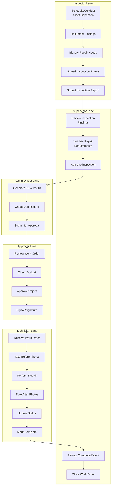

# Workflow Option 2: Internal Inspection & KEW.PA-10 Generation

## Overview

This workflow handles proactive internal asset inspections that identify maintenance needs
and generate KEW.PA-10 forms internally.

**Primary Users**: Inspector, Supervisor, Admin Officer, Approver, Technician

**Entry Point**: Scheduled or ad-hoc internal asset inspection

**Exit Point**: Completed repair with internally-generated KEW.PA-10

## Workflow Diagram



## Workflow Steps

### 1. Inspector: Schedule/Conduct Asset Inspection

**Role**: Pemeriksa (Inspector)

**Actions**:

- Access inspection schedule or create ad-hoc inspection
- Select asset(s) for inspection
- Travel to asset location
- Conduct physical inspection
- Use mobile app for field data entry

**Inspection Types**:

- 📅 **Scheduled** - Routine preventive maintenance checks
- 🔍 **Ad-hoc** - Requested inspections or incident response
- ✅ **Follow-up** - Re-inspection after repairs
- 📊 **Audit** - Compliance verification

**Mobile Features**:

- Offline data entry
- GPS location tracking
- Barcode/QR code scanning for asset ID
- Photo capture directly to form

### 2. Inspector: Document Findings

**Actions**:

- Complete digital inspection checklist
- Rate asset condition (1-5 scale)
- Document all observed issues
- Note safety concerns
- Identify required repairs or maintenance

**Inspection Checklist Fields**:

```yaml
Asset Information:
  - Asset ID: [Scanned/Manual]
  - Asset Type: [Dropdown]
  - Location: [GPS + Manual]
  - Current Condition: [1-5 Rating]

Physical Inspection:
  - Visual Condition: [Good/Fair/Poor/Critical]
  - Structural Integrity: [Checklist]
  - Functional Status: [Working/Partial/Not Working]
  - Safety Hazards: [Yes/No + Description]

Maintenance Needs:
  - Immediate Repair: [Yes/No]
  - Preventive Maintenance: [Yes/No]
  - Parts Replacement: [List]
  - Estimated Urgency: [High/Medium/Low]
```

### 3. Inspector: Identify Repair Needs

**Actions**:

- Determine if repairs are required
- Estimate repair complexity
- List required parts and materials
- Set priority level
- Add detailed repair recommendations

**Repair Classification**:

- 🔴 **Urgent** - Safety hazard or critical function failure
- 🟡 **Medium** - Reduced functionality or efficiency
- 🟢 **Low** - Cosmetic or preventive maintenance

**Repair Estimation**:

- Estimated repair time
- Required technician skills
- Parts needed (from inspection)
- Special tools or equipment required

### 4. Inspector: Upload Inspection Photos

**Actions**:

- Take photos of asset from multiple angles
- Document specific issues with close-up photos
- Capture safety hazards
- Ensure photo quality and clarity
- Add captions/annotations

**Photo Requirements**:

- Minimum 5 photos per inspection
- Maximum 20MB per photo
- Formats: JPG, PNG
- Metadata preserved (timestamp, GPS)

**Photo Categories**:

- Overall asset condition
- Specific damage or wear
- Safety hazards
- Asset ID plate/label
- Surrounding environment

### 5. Inspector: Submit Inspection Report

**Actions**:

- Review all inspection data
- Ensure completeness
- Add final recommendations
- Digital signature
- Submit for supervisor review

**Validation Checks**:

- All required fields completed
- Minimum photos uploaded
- Condition rating provided
- Repair needs specified (if applicable)

### 6. Supervisor: Review Inspection Findings

**Role**: Penyelia (Supervisor)

**Actions**:

- Review inspector's findings and photos
- Verify inspection completeness
- Assess repair priority
- Validate estimated costs
- Determine if KEW.PA-10 generation is needed

**Review Criteria**:

- Inspection data is complete and accurate
- Photos clearly show issues
- Repair recommendations are appropriate
- Priority level is justified
- Cost estimates are reasonable

**Decision Options**:

- ✅ **Approve** - Proceed to KEW.PA-10 generation
- ⚠️ **Request Revision** - Inspector must update
- ❌ **Reject** - No repair needed or incorrect assessment
- 📋 **More Info Needed** - Request additional inspection

### 7. Supervisor: Validate Repair Requirements

**Actions**:

- Confirm parts availability or procurement timeline
- Verify technician availability
- Check workshop capacity
- Estimate total cost including labor and parts
- Determine if budget approval is needed

**Validation Points**:

- Parts in stock or can be procured
- Qualified technician available
- Workshop has capacity
- Repair is cost-effective vs replacement
- Aligns with maintenance schedule

### 8. Admin Officer: Generate KEW.PA-10

**Role**: Pentadbiran (Admin Officer)

**Actions**:

- Create new KEW.PA-10 form in system
- Auto-populate from inspection data
- Generate KEW.PA-10 reference number
- Add budget allocation code
- Attach inspection report and photos
- Set approval workflow

**KEW.PA-10 Auto-Population**:

```php
KEW_PA_10 {
  reference_number: Auto (KEW-YYYY-NNNNN)
  date: Current date
  asset_id: From inspection
  asset_description: From asset database
  location: From inspection GPS/manual
  repair_description: From inspector findings
  estimated_cost: From supervisor validation
  urgency: From inspection priority
  requesting_officer: Inspector name
  inspection_photos: Linked attachments
}
```

### 9. Admin Officer: Create Job Record

**Actions**:

- Create linked job record
- Associate with KEW.PA-10
- Set initial job status (Pending Approval)
- Configure notification recipients
- Generate job reference number

**Job Data**:

- Job Reference: WS-YYYY-NNNN (auto)
- KEW.PA-10 Link: Reference number
- Status: Pending Approval
- Created By: Admin Officer
- Created Date: Auto timestamp

### 10. Approver: Review Work Order

**Role**: Pelulus (Approver)

**Actions**:

- Review KEW.PA-10 and linked inspection
- Examine photos and findings
- Verify repair necessity
- Review cost estimates
- Check previous maintenance history

**Review Dashboard Shows**:

- Inspection summary with photos
- Estimated costs breakdown
- Budget allocation status
- Asset maintenance history
- Similar past repairs

### 11. Approver: Check Budget

**Actions**:

- Verify budget code exists
- Check available budget allocation
- Confirm cost is within approval limits
- Review departmental budget status
- Document budget impact

**Budget Validation**:

```yaml
Budget Check:
  - Code Valid: Yes/No
  - Available Balance: Amount
  - This Repair Cost: Amount
  - Remaining After: Amount
  - Approval Required: Yes/No (if over threshold)
```

**Approval Thresholds**:

- < RM 1,000: Supervisor approval only
- RM 1,000 - RM 5,000: Single approver
- RM 5,000 - RM 20,000: Two approvers
- > RM 20,000: Department head + finance

### 12. Approver: Approve/Reject with Digital Signature

**Actions**:

- Make approval decision
- Add approval comments
- Set conditions (if conditional approval)
- Apply digital signature
- Submit decision

**Approval Options**:

- ✅ **Fully Approved** - Proceed to repair
- ⚠️ **Conditionally Approved** - With budget/scope limits
- 🔄 **Request More Info** - Need clarification
- ❌ **Rejected** - Not justified or budget unavailable

**Digital Signature**:

- Cryptographic signature using MyKad or government cert
- Timestamp and user details embedded
- Non-repudiation for audit
- PDF certificate generated

### 13. Technician: Perform Repair Work

**Role**: Juruteknik (Technician)

**Actions**:

- Receive approved work order notification
- Review KEW.PA-10, inspection report, and photos
- Plan repair approach
- Gather tools and parts
- Take before photos (if different from inspection)
- Execute repair work
- Document process
- Take during and after photos

**Work Documentation**:

- Start time logged
- Parts selected from inventory (auto-deducted)
- Work notes added throughout
- Issues or deviations documented
- End time logged

**Photo Requirements**:

- Before repair: 3+ photos
- During repair: 3+ photos of critical steps
- After repair: 5+ photos from multiple angles
- Quality check photo

### 14. Technician: Mark Complete

**Actions**:

- Complete work summary form
- Confirm all photos uploaded
- Record actual vs estimated time
- List all parts used
- Add recommendations for future maintenance
- Digital signature
- Submit for supervisor review

**Completion Checklist**:

- [ ] All repair work completed as specified
- [ ] Quality self-check passed
- [ ] All photos uploaded and tagged
- [ ] Parts usage documented
- [ ] Work area cleaned and secured
- [ ] Asset tested and functional
- [ ] Safety check completed

### 15. Supervisor: Review and Close

**Actions**:

- Review technician's work completion report
- Verify photo documentation
- Validate parts usage
- Conduct final quality inspection (if required)
- Approve work completion
- Close job and KEW.PA-10
- Generate completion report

**Final Documentation Package**:

- Original inspection report
- Generated KEW.PA-10 form
- Approval records with signatures
- Before/during/after photos
- Parts usage list
- Time logs
- Completion certificate
- All digital signatures

## Role Permissions

### Inspector (Pemeriksa)

- ✅ Schedule inspections
- ✅ Conduct inspections
- ✅ Upload photos
- ✅ Submit reports
- ✅ View inspection history
- ❌ Generate KEW.PA-10
- ❌ Approve budgets

### Supervisor (Penyelia)

- ✅ Review inspections
- ✅ Validate repair requirements
- ✅ Approve inspections
- ✅ Review completed work
- ✅ Close work orders
- ❌ Generate KEW.PA-10
- ❌ Final budget approval

### Admin Officer (Pentadbiran)

- ✅ Generate KEW.PA-10
- ✅ Create job records
- ✅ Submit for approval
- ✅ Manage workflows
- ✅ Generate reports
- ❌ Approve budgets
- ❌ Conduct inspections

### Approver (Pelulus)

- ✅ Review work orders
- ✅ Check budgets
- ✅ Approve/reject repairs
- ✅ Digital signature authority
- ✅ View all reports
- ❌ Conduct repairs
- ❌ Generate KEW.PA-10

### Technician (Juruteknik)

- ✅ View assigned work
- ✅ Perform repairs
- ✅ Upload photos
- ✅ Update work status
- ✅ Record parts usage
- ❌ Approve work
- ❌ Generate KEW.PA-10

## Comparison: Option 1 vs Option 2

| Aspect | Option 1 (External) | Option 2 (Internal) |
|--------|-------------------|-------------------|
| **Initiation** | External KEW.PA-10 received | Internal inspection |
| **KEW.PA-10** | Pre-existing | Generated internally |
| **Roles Involved** | 4 roles | 5 roles (adds Approver) |
| **Approval Flow** | Simpler (Inspector only) | Complex (Inspector + Approver) |
| **Budget Check** | External department | Internal budget verification |
| **Timeline** | Faster (no approval delay) | Longer (approval required) |
| **Use Case** | Reactive repairs | Proactive maintenance |

## System Features

### Inspection Module

- Mobile-optimized inspection forms
- Offline capability with sync
- GPS and photo metadata
- Asset barcode scanning
- Inspection history tracking

### Approval Workflow Engine

- Configurable approval chains
- Budget threshold routing
- Email/SMS notifications
- Escalation for delays
- Delegation support

### Digital Signature Integration

- MyKad integration
- Government certificate authority
- Signature verification
- Non-repudiation audit trail
- PDF signing

## Bilingual Support

System fully supports:

- **Bahasa Malaysia** - Primary government language
- **English** - Secondary

**Bilingual Elements**:

- All forms and labels
- Email notifications
- Reports and certificates
- Mobile app interface
- Help documentation

## Performance Metrics

Track workflow efficiency:

- Average inspection time
- Approval cycle time
- Inspector productivity
- Work order completion rate
- Budget utilization accuracy

## Related Documents

- [Workflow Option 1](07-workflow-option-1.md) - External KEW.PA-10 reception
- [Database Design](02-database-design.md) - Inspection and approval tables
- [Security Architecture](05-security-architecture.md) - Digital signature
- [User Roles](../06-user-guide/01-user-roles.md) - Role permissions

---

**Last Updated**: 2025-12-28
**Version**: 1.0
**Status**: Active
