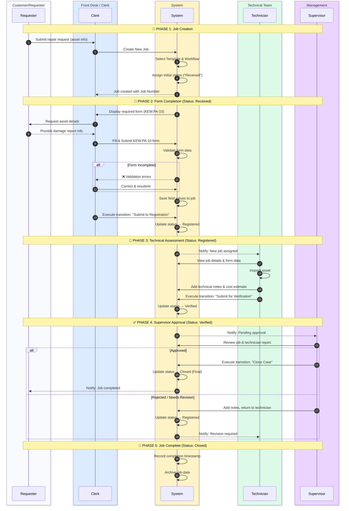
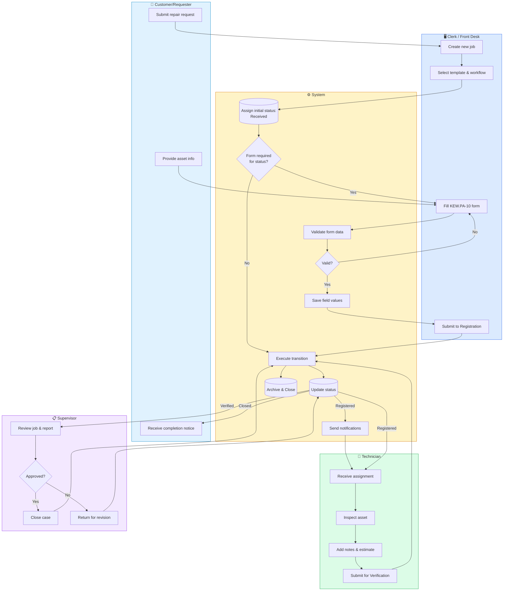
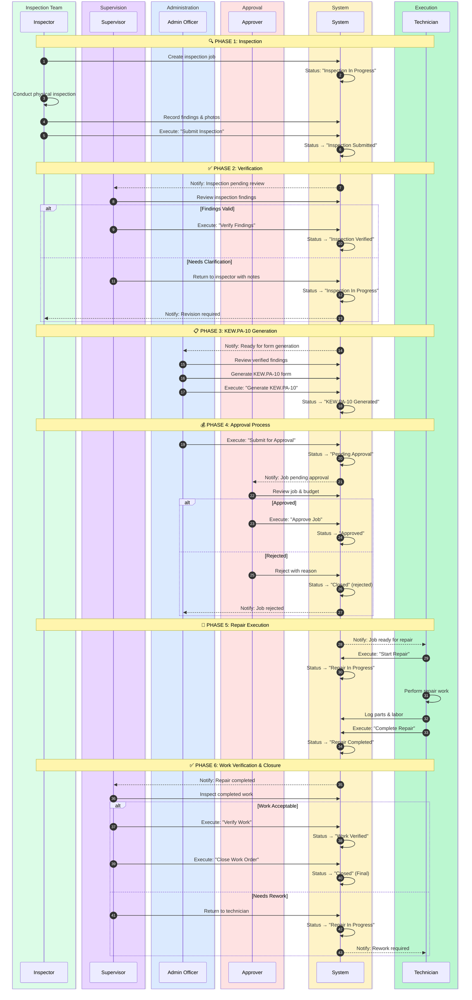
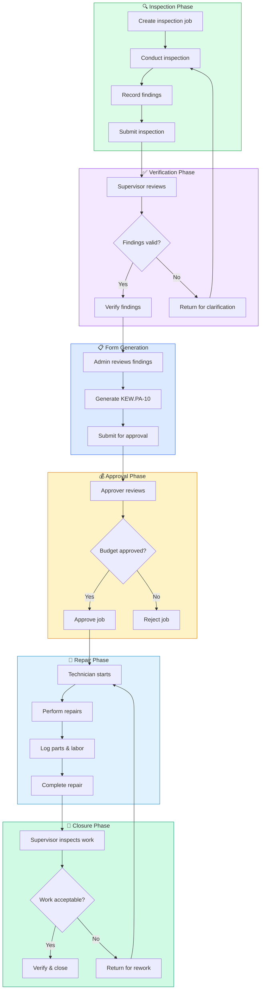
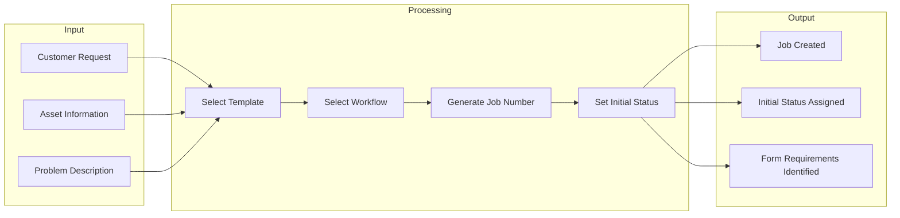
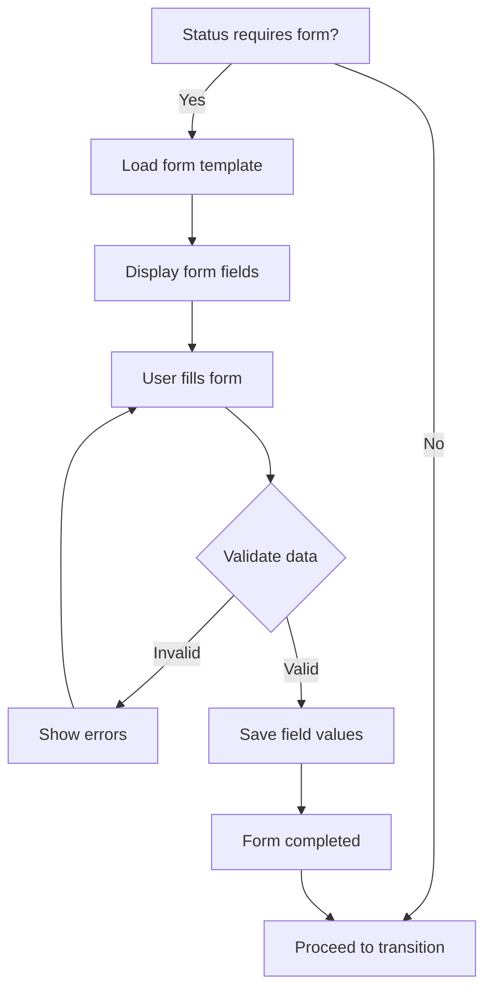
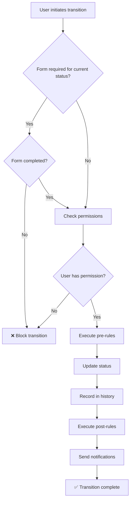
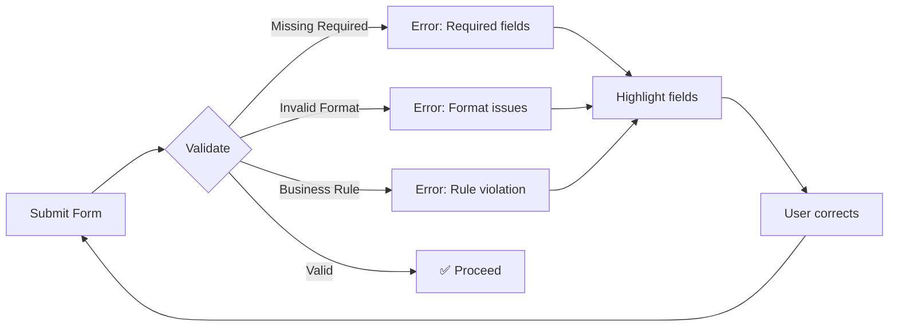
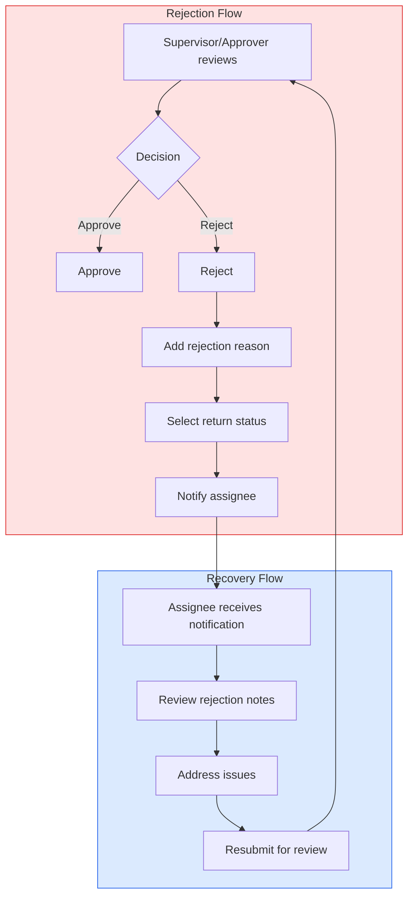
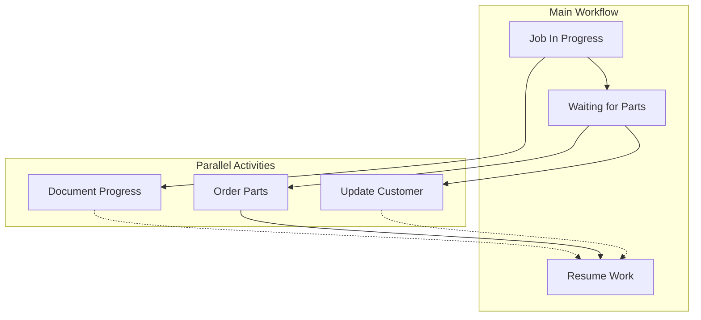

# Workflow Swimlane Diagrams

> **Last Updated**: 2026-01-08

This document provides comprehensive swimlane diagrams illustrating the complete job lifecycle from creation to completion for all workflow types in the Workshop Management System.

---

## Table of Contents

1. [Actors Overview](#actors-overview)
2. [KEW.PA-10 External Reception Workflow](#kewpa-10-external-reception-workflow)
3. [Internal Inspection Workflow](#internal-inspection-workflow)
4. [Detailed Phase Breakdown](#detailed-phase-breakdown)
5. [Error Handling & Rejection Flows](#error-handling--rejection-flows)

---

## Actors Overview

The following actors participate in job workflows:

| Actor | Role | Responsibilities |
|-------|------|------------------|
| **Customer/Requester** | External party or internal staff | Submits repair requests, provides asset information |
| **Clerk/Operator** | Front desk staff | Creates jobs, fills forms, manages initial data entry |
| **Technician** | Technical staff | Performs inspections, repairs, adds technical notes |
| **Supervisor** | Management | Verifies work, approves/rejects jobs |
| **Approver** | Senior management | Budget approval, final sign-off |
| **System** | Automated | Validation, notifications, status updates |

---

## KEW.PA-10 External Reception Workflow

This workflow handles external repair requests where the customer brings an asset for repair.

### Workflow States

```
Received → Registered → Verified → Closed
```

### Sequence Diagram



### Flowchart View



---

## Internal Inspection Workflow

This workflow handles proactive internal asset inspections that may result in repair jobs.

### Workflow States

```
Inspection In Progress → Inspection Submitted → Inspection Verified → 
KEW.PA-10 Generated → Pending Approval → Approved → 
Repair In Progress → Repair Completed → Work Verified → Closed
```

### Sequence Diagram



### Flowchart View



---

## Detailed Phase Breakdown

### Phase 1: Job Creation



### Phase 2: Form Submission



### Phase 3: Status Transition



---

## Error Handling & Rejection Flows

### Form Validation Errors



### Rejection Handling



### Parallel Processing



---

## Status Color Reference

| Status Type | Color | Hex Code | Usage |
|-------------|-------|----------|-------|
| Initial | 🟡 Amber | `#f59e0b` | Starting states |
| In Progress | 🔵 Blue | `#3b82f6` | Active work |
| Pending | 🟠 Orange | `#f97316` | Awaiting action |
| Verified | 🟣 Purple | `#8b5cf6` | Reviewed states |
| Approved | 🟢 Green | `#22c55e` | Approved states |
| Final/Closed | ⚫ Slate | `#1e293b` | Completed |
| Error | 🔴 Red | `#ef4444` | Error states |

---

## Related Documents

- [Workflow Option 1 - External Reception](07-workflow-option-1.md)
- [Workflow Option 2 - Internal Inspection](08-workflow-option-2.md)
- [Entity Relationship Diagram](erd.md)
- [Sprint 2: Workflow Restructuring](../04-sprints/05-sprint-2-workflow-restructuring.md)

---

**Last Updated**: 2026-01-08
