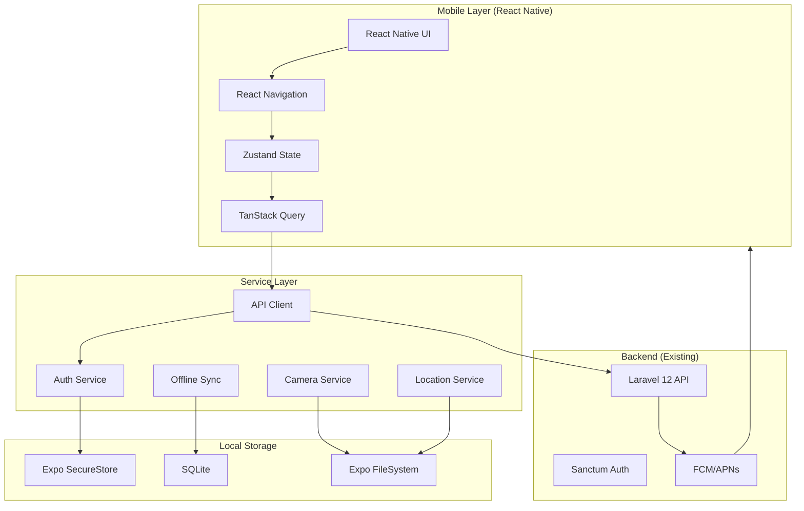
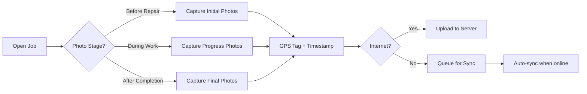

# Mobile Application: Product Requirements Document

> **Version**: 1.0  
> **Status**: Planning  
> **Last Updated**: 2026-02-02  
> **Platform**: React Native + Expo  
> **Target**: iOS 14+ and Android 8.0+ (API 26+)

---

## Executive Summary

This document defines the requirements for the **Workshop Management System Mobile Application**, a companion mobile app for field technicians, inspectors, and supervisors to perform their duties on-site without being tethered to desktop computers.

### Business Objectives

| Objective | Success Metric | Target |
|-----------|---------------|--------|
| **Increase Field Productivity** | Reduce job completion time | 30% reduction |
| **Improve Evidence Quality** | Photo compliance rate | 95%+ with GPS tags |
| **Enable Offline Work** | Jobs completed without connectivity | 60%+ of field jobs |
| **Reduce Data Entry Errors** | Form validation failures | <5% error rate |
| **Faster Status Updates** | Real-time job status visibility | <2 min latency |

### Strategic Rationale

> [!IMPORTANT]
> **Why Mobile Matters for Government Operations**
>
> - 🏗️ **Workshop Environment**: Technicians work in repair bays without computer access
> - 📸 **Evidence Collection**: KEW.PA-10 requires timestamped, geotagged photos
> - 👨‍🔧 **Field Inspections**: Inspectors need mobile access to asset databases
> - ⚡ **Speed**: Reduce paperwork → digitization lag from hours to minutes
> - 📴 **Connectivity**: Government workshops often have unreliable internet

---

## Technology Stack

### Selected: React Native + Expo (Option 1) ✅



### Core Dependencies

```json
{
  "dependencies": {
    "@react-navigation/native": "^6.x",
    "@react-navigation/stack": "^6.x",
    "@tanstack/react-query": "^5.x",
    "zustand": "^4.x",
    "axios": "^1.x",
    "expo": "~51.x",
    "expo-camera": "~15.x",
    "expo-location": "~17.x",
    "expo-secure-store": "~13.x",
    "expo-sqlite": "~14.x",
    "expo-file-system": "~17.x",
    "expo-image-picker": "~15.x",
    "expo-notifications": "~0.28.x",
    "nativewind": "^4.x",
    "react-native-paper": "^5.x",
    "date-fns": "^3.x"
  }
}
```

---

## User Roles & Access Levels

### Primary Mobile Users

| Role | Malay Name | Mobile Priority | Key Features |
|------|------------|-----------------|--------------|
| 🟢 **Technician** | Juruteknik | **HIGH** | Photo upload, job completion, repair notes |
| 🔵 **Inspector** | Pemeriksa | **HIGH** | Inspection reports, photo evidence, asset validation |
| 🟣 **Supervisor** | Penyelia | **MEDIUM** | Job review, assignment, approval |
| 🟡 **Admin Officer** | Pentadbiran | **LOW** | Job creation, customer registration (tablet mode) |
| 🔴 **Approver** | Pelulus | **LOW** | Work order approval (notification review) |

### Role-Based Feature Matrix

| Feature | Technician | Inspector | Supervisor | Admin | Approver |
|---------|------------|-----------|------------|-------|----------|
| View assigned jobs | ✅ | ✅ | ✅ | ✅ | ✅ |
| Capture photos | ✅ | ✅ | ❌ | ❌ | ❌ |
| Upload evidence | ✅ | ✅ | ❌ | ❌ | ❌ |
| Create inspection reports | ❌ | ✅ | ❌ | ❌ | ❌ |
| Complete jobs | ✅ | ❌ | ❌ | ❌ | ❌ |
| Assign jobs | ❌ | ❌ | ✅ | ✅ | ❌ |
| Approve work orders | ❌ | ❌ | ❌ | ❌ | ✅ |
| Create new jobs | ❌ | ❌ | ❌ | ✅ | ❌ |
| View analytics | ❌ | ❌ | ✅ | ✅ | ✅ |

---

## Feature Requirements

### Phase 1: Core Mobile App (MVP) - 6 Weeks

#### 1.1 Authentication & Security

**Requirements:**
- [ ] Sanctum token-based authentication
- [ ] Biometric login (Touch ID / Face ID)
- [ ] PIN code fallback
- [ ] Auto-logout after 15 minutes inactivity
- [ ] Secure token storage in Expo SecureStore
- [ ] Certificate pinning for API calls

**User Stories:**
```gherkin
Given a registered technician with mobile access
When they open the app for the first time
Then they should be able to login with email/password
And enable biometric authentication
And see their assigned jobs dashboard
```

#### 1.2 Job Management

**Requirements:**
- [ ] View list of assigned jobs (technician-specific)
- [ ] Filter jobs by status (Pending, In Progress, Completed)
- [ ] Search jobs by reference number or customer name
- [ ] View job details (customer info, asset details, workflow status)
- [ ] View job history and notes
- [ ] Pull-to-refresh for real-time updates

**UI Mockup:**
```
┌─────────────────────────┐
│  📱 My Jobs             │
├─────────────────────────┤
│ 🔍 Search jobs...       │
│                         │
│ ⚪ All  🟡 Pending      │
│ 🔵 In Progress  ✅ Done │
├─────────────────────────┤
│ KEW-001 🟡              │
│ Repair AC Unit          │
│ Due: Today 2:00 PM      │
│ Customer: JPN Selangor  │
├─────────────────────────┤
│ KEW-002 🔵              │
│ Lift Maintenance        │
│ Due: Tomorrow           │
│ Customer: Pejabat Daerah│
└─────────────────────────┘
```

#### 1.3 Photo Evidence Management

**Requirements:**
- [ ] Camera integration with Expo Camera
- [ ] Photo capture with real-time preview
- [ ] Automatic GPS tagging
- [ ] Automatic timestamp embedding
- [ ] Photo stage categorization (Before, During, After)
- [ ] Minimum photo enforcement (e.g., 2 before photos required)
- [ ] Photo compression before upload (max 2MB per photo)
- [ ] Offline photo queue with auto-sync
- [ ] Photo annotation (optional text descriptions)

**User Flow:**


**Technical Specifications:**
- **Image Format**: JPEG
- **Max Resolution**: 1920x1080 (Full HD)
- **Compression**: 80% quality
- **EXIF Data**: Preserve GPS, timestamp
- **Storage**: Local cache → Server upload → Local deletion

#### 1.4 Offline Mode

**Requirements:**
- [ ] SQLite local database for job data
- [ ] Automatic sync when internet available
- [ ] Conflict resolution (server wins)
- [ ] Offline indicator in UI
- [ ] Queue for pending uploads (photos, status updates, notes)
- [ ] Background sync using Expo Task Manager

**Sync Strategy:**
```
Download (Server → Mobile):
- Assigned jobs for current user
- Job templates and field definitions
- Workflow statuses
- User profile

Upload (Mobile → Server):
- Photo evidence
- Job status updates
- Notes and comments
- Inspection reports
- Completion reports
```

#### 1.5 Status Updates & Transitions

**Requirements:**
- [ ] Update job status based on workflow transitions
- [ ] Role-based status change permissions
- [ ] Mandatory field validation before status change
- [ ] Optimistic UI updates
- [ ] Rollback on server error

**Example:**
```
Technician can:
- "In Progress" → "Repair Completed"
  Required: Minimum 2 "After Repair" photos
  
Inspector can:
- "Pending Inspection" → "Inspection Complete"
  Required: Inspection report filled
```

---

### Phase 2: Enhanced Features - 4 Weeks

#### 2.1 Push Notifications

**Requirements:**
- [ ] Job assignment notifications
- [ ] Job reassignment alerts
- [ ] Status change notifications
- [ ] Comment/note notifications
- [ ] Due date reminders (1 day before)
- [ ] Notification preferences (in-app settings)

**Notification Types:**
```
🔔 Job Assigned: "New job assigned: KEW-001 Repair AC Unit"
⚠️ Due Soon: "Job KEW-001 due in 1 hour"
✅ Approved: "Job KEW-002 approved by supervisor"
💬 New Comment: "Supervisor added a note to KEW-003"
```

#### 2.2 Inspection Reports (Inspector Role)

**Requirements:**
- [ ] Dynamic form rendering (same as web)
- [ ] Multi-section inspection forms
- [ ] Photo attachments per section
- [ ] Conditional field visibility
- [ ] Draft saving
- [ ] Signature capture (inspector signature)

#### 2.3 Completion Reports (Technician Role)

**Requirements:**
- [ ] Repair summary form
- [ ] Parts used tracking
- [ ] Time spent logging
- [ ] Technician signature
- [ ] Final photo gallery review
- [ ] Submit for supervisor review

#### 2.4 Barcode/QR Code Scanner

**Requirements:**
- [ ] Scan asset QR codes
- [ ] Auto-populate asset details
- [ ] Quick job lookup by reference QR
- [ ] Expo BarCodeScanner integration

---

### Phase 3: Advanced Features - 2 Weeks

#### 3.1 Analytics Dashboard (Supervisor/Admin)

**Requirements:**
- [ ] Jobs completed this week/month
- [ ] Technician productivity metrics
- [ ] Average completion time
- [ ] Photo compliance percentage
- [ ] Offline mode analytics

#### 3.2 Voice Notes

**Requirements:**
- [ ] Audio recording for job notes
- [ ] Speech-to-text conversion
- [ ] Attach audio files to jobs

#### 3.3 Multi-language Support

**Requirements:**
- [ ] Malay (Bahasa Malaysia) - Primary
- [ ] English - Secondary
- [ ] Language switcher in settings

---

## Non-Functional Requirements

### Performance

| Metric | Target | Critical Threshold |
|--------|--------|-------------------|
| **App Launch Time** | <3 seconds | <5 seconds |
| **Screen Transition** | <500ms | <1 second |
| **Photo Capture** | <2 seconds | <4 seconds |
| **API Response** | <1 second | <3 seconds |
| **Offline Sync** | Background | N/A |

### Security

> [!CAUTION]
> **Security Requirements for Government Data**

- ✅ All API calls over HTTPS (TLS 1.3)
- ✅ Certificate pinning to prevent MITM attacks
- ✅ Tokens stored in Expo SecureStore (encrypted)
- ✅ Biometric authentication (iOS Face ID / Android BiometricPrompt)
- ✅ Auto-logout after 15 minutes inactivity
- ✅ No sensitive data in logs or analytics
- ✅ Photo EXIF stripping for customer privacy (optional)

### Compatibility

**iOS:**
- Minimum: iOS 14.0
- Target: iOS 17.x
- Devices: iPhone 8 and newer

**Android:**
- Minimum: Android 8.0 (API 26)
- Target: Android 14 (API 34)
- Devices: Phones with 2GB+ RAM

### Data Usage

**Estimated bandwidth per technician per day:**
- Photo uploads: 20 photos × 1.5MB = 30MB
- API calls: ~5MB
- **Total**: ~35MB/day

**Offline storage:**
- SQLite database: <50MB
- Cached photos: <200MB (auto-cleared after upload)

---

## API Requirements

### New Endpoints Needed

#### Authentication
```http
POST /api/mobile/login
POST /api/mobile/logout
POST /api/mobile/refresh-token
```

#### Jobs
```http
GET /api/mobile/jobs (user-specific, paginated)
GET /api/mobile/jobs/{id}
PUT /api/mobile/jobs/{id}/status
POST /api/mobile/jobs/{id}/notes
```

#### Photos
```http
POST /api/mobile/jobs/{id}/photos
GET /api/mobile/jobs/{id}/photos
DELETE /api/mobile/photos/{photoId}
```

#### Sync
```http
POST /api/mobile/sync (bulk upload)
GET /api/mobile/sync/pending
```

#### Notifications
```http
POST /api/mobile/fcm-token (register device)
GET /api/mobile/notifications
PUT /api/mobile/notifications/{id}/read
```

### Response Optimization

**Mobile-specific optimizations:**
- Smaller payload sizes (exclude unnecessary fields)
- Pagination (20 items per page)
- Conditional fields (only send if user has permission)
- Image thumbnails (separate from full resolution)

---

## Development Roadmap

### Sprint 1: Foundation (Week 1-2)

- [ ] Initialize Expo project
- [ ] Setup React Navigation
- [ ] Implement Sanctum authentication
- [ ] Create login screen with biometric support
- [ ] Setup TanStack Query for API caching
- [ ] Create job list screen
- [ ] Create job detail screen

### Sprint 2: Photo & Offline (Week 3-4)

- [ ] Integrate Expo Camera
- [ ] Implement photo capture with GPS
- [ ] Setup SQLite for offline storage
- [ ] Implement offline sync queue
- [ ] Create photo gallery view
- [ ] Test offline mode thoroughly

### Sprint 3: Status & Forms (Week 5-6)

- [ ] Implement status update flow
- [ ] Create dynamic form renderer
- [ ] Add validation and error handling
- [ ] Implement pull-to-refresh
- [ ] Add loading states and skeletons
- [ ] User acceptance testing

### Sprint 4: Notifications & Polish (Week 7-8)

- [ ] Setup Firebase Cloud Messaging
- [ ] Implement push notifications
- [ ] Create notification center
- [ ] Add settings screen
- [ ] Implement analytics tracking
- [ ] Performance optimization

### Sprint 5: Inspection & Completion (Week 9-10)

- [ ] Inspection report form
- [ ] Completion report form
- [ ] Signature capture
- [ ] Parts tracking
- [ ] E2E testing with real users

### Sprint 6: Advanced Features (Week 11-12)

- [ ] Barcode scanner
- [ ] Analytics dashboard
- [ ] Multi-language support
- [ ] Final polish and bug fixes
- [ ] Production deployment

---

## Testing Strategy

### Unit Testing
- React component testing with Jest + React Native Testing Library
- Service layer testing
- State management testing
- Target: 70%+ code coverage

### Integration Testing
- API integration tests
- Offline sync testing
- Photo upload workflow
- Authentication flow

### E2E Testing
- Critical user flows with Maestro or Detox
- Technician job completion flow
- Inspector inspection flow
- Offline → Online sync

### Manual Testing
- Device compatibility testing (5+ devices)
- Real-world field testing with technicians
- Network condition testing (3G, 4G, Wi-Fi, Offline)
- Battery usage profiling

### User Acceptance Testing (UAT)
- 5 technicians × 2 weeks pilot
- 2 inspectors × 2 weeks pilot
- Feedback collection and iteration

---

## Deployment Strategy

### Beta Testing (TestFlight + Google Play Internal Testing)

**Week 10-11:**
- [ ] Submit to TestFlight (iOS)
- [ ] Submit to Google Play Internal Track
- [ ] Invite 10 beta testers
- [ ] Collect crash reports and feedback
- [ ] Fix critical bugs

### Production Release

**Week 12:**
- [ ] App Store submission (iOS)
- [ ] Google Play production release
- [ ] Staged rollout (10% → 50% → 100%)
- [ ] Monitor crash rates (<1%)
- [ ] Monitor API performance

### Distribution Options

| Method | Use Case | Pros | Cons |
|--------|----------|------|------|
| **App Store Public** | Public release | Wide reach | Apple review process |
| **TestFlight** | Beta testing | Easy distribution | 90-day limit |
| **Enterprise Distribution** | Government-only | No App Store needed | Requires Apple Enterprise license |
| **Google Play Public** | Public release | Wide reach | Review process |
| **Internal Testing** | Beta testing | Instant updates | Limited testers |

> [!TIP]
> **Recommendation for Government**: Use **Enterprise Distribution (iOS)** and **Private Google Play** to avoid public app stores and maintain full control over distribution.

---

## Budget & Resource Allocation

### Development Team

| Role | Allocation | Weekly Hours | Duration |
|------|------------|--------------|----------|
| **React Native Developer** | Full-time | 40 hours | 12 weeks |
| **Backend Developer** | 50% | 20 hours | 12 weeks |
| **UI/UX Designer** | 25% | 10 hours | 4 weeks |
| **QA Engineer** | 50% | 20 hours | 8 weeks |
| **Project Manager** | 25% | 10 hours | 12 weeks |

### Cost Estimate

| Item | Cost (RM) | Notes |
|------|-----------|-------|
| Development Labor | 60,000 - 80,000 | 2-3 developers × 3 months |
| Apple Developer Account | 500/year | For iOS distribution |
| Google Play Account | 100 (one-time) | For Android distribution |
| Firebase (Push Notifications) | 0 - 500/month | Free tier sufficient for MVP |
| Testing Devices | 3,000 - 5,000 | 3-4 test devices |
| **Total MVP**: | **RM 63,600 - 86,100** | |
| **Monthly Maintenance**: | **RM 2,000 - 3,000** | Bug fixes, updates |

---

## Success Metrics (KPIs)

### Usage Metrics

| Metric | Target (3 months) | Measurement |
|--------|-------------------|-------------|
| **Daily Active Users** | 70% of field staff | Analytics |
| **Jobs Completed via Mobile** | 80%+ | Backend logs |
| **Photo Compliance** | 95%+ jobs with required photos | Database query |
| **Offline Mode Usage** | 60%+ field jobs | Sync logs |
| **Average Session Time** | 10-15 minutes | Analytics |

### Quality Metrics

| Metric | Target | Measurement |
|--------|--------|-------------|
| **Crash Rate** | <1% | Sentry/Firebase Crashlytics |
| **API Error Rate** | <2% | Server logs |
| **User Rating** | 4.0+ stars | App Store reviews |
| **User Satisfaction** | 80%+ satisfied | Survey |

### Business Impact

| Metric | Target | Measurement |
|--------|--------|-------------|
| **Job Completion Time** | -30% reduction | Time tracking |
| **Data Entry Errors** | -50% reduction | Error logs |
| **Photo Evidence Quality** | 95%+ GPS-tagged | EXIF analysis |

---

## Risks & Mitigation

| Risk | Impact | Probability | Mitigation |
|------|--------|-------------|------------|
| **Device fragmentation (Android)** | High | High | Test on 5+ popular devices; use React Native stable APIs |
| **Poor network in workshops** | High | Medium | Robust offline mode; background sync |
| **Battery drain from GPS** | Medium | Medium | Request location only during photo capture |
| **User resistance to change** | Medium | Low | Comprehensive training; gradual rollout |
| **App Store rejection** | Low | Low | Follow guidelines; plan 2-week buffer |
| **Photo storage costs** | Medium | Medium | Compress images; delete after cloud sync |

---

## Appendix

### A. Competitive Analysis

| Feature | Our App | Competitor A | Competitor B |
|---------|---------|--------------|--------------|
| Offline Mode | ✅ Full | ⚠️ Limited | ❌ No |
| Biometric Auth | ✅ Yes | ✅ Yes | ❌ No |
| GPS Photo Tags | ✅ Automatic | ⚠️ Manual | ❌ No |
| Push Notifications | ✅ Yes | ✅ Yes | ✅ Yes |
| Dynamic Forms | ✅ Yes | ❌ No | ❌ No |
| KEW.PA-10 Compliance | ✅ Built-in | ❌ No | ❌ No |

### B. Technical Debt Prevention

- Use TypeScript for type safety
- Follow React Native best practices
- Implement CI/CD from day 1
- Write tests for critical paths
- Document all API contracts
- Regular dependency updates

### C. Future Enhancements (Post-MVP)

- [ ] Voice-to-text notes
- [ ] Augmented Reality for asset identification
- [ ] Machine learning for photo quality checking
- [ ] Predictive maintenance alerts
- [ ] Integration with IoT sensors
- [ ] Wearable device support (smartwatch)

---

## Approval & Sign-Off

| Stakeholder | Role | Approval Date | Signature |
|-------------|------|---------------|-----------|
| Zuraid Ismail | Product Owner | Pending | ___________ |
| Technical Lead | Engineering | Pending | ___________ |
| QA Lead | Quality Assurance | Pending | ___________ |

---

**Document Status**: ✅ Ready for Review  
**Next Steps**: 
1. Review and approve this PRD
2. Setup React Native + Expo project
3. Create Sprint 1 implementation plan
4. Begin development

**Related Documents**:
- [Architecture Overview](../ARCHITECTURE_CAPABILITY_OVERVIEW.md)
- [Dynamic Workflow System](../../DYNAMIC_WORKFLOW_SYSTEM.md)
- [Backend API Documentation](../02-architecture/06-api-design.md)
