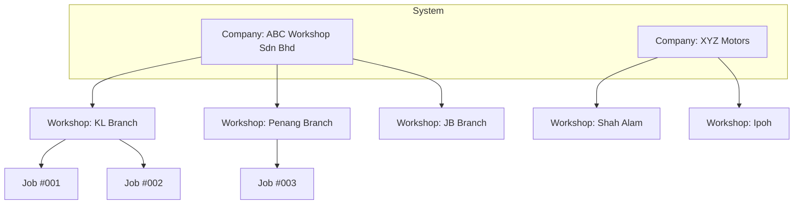

# Multi-Tenant Architecture

> **Purpose**: Explain how the Workshop Management System handles multiple companies with multiple workshops  
> **Audience**: Solution Architects, Backend Developers

---

## Overview

The Workshop Management System implements **multi-tenancy** to support:
- Multiple **companies** (tenants) in a single deployment
- Multiple **workshops** per company across different regions
- **Data isolation** ensuring companies only see their own data

---

## Tenancy Model

### Company → Workshop Hierarchy



---

## Database Design

### Companies Table

| Column | Type | Description |
|--------|------|-------------|
| id | bigint | Primary key |
| name | string | Company name (e.g., "ABC Workshop Sdn Bhd") |
| code | string | Unique slug (e.g., "abc-workshop") |
| registration_number | string | Business registration (SSM) |
| settings | json | Company-wide settings |

### Workshops Table

| Column | Type | Description |
|--------|------|-------------|
| id | bigint | Primary key |
| company_id | bigint | FK to companies |
| name | string | Workshop name (e.g., "KL Branch") |
| code | string | Unique within company |
| region | string | Geographic region |
| manager_id | bigint | FK to users |

### User-Workshop Assignment

**Many-to-Many Relationship** via `user_workshops` pivot:

| Column | Type | Description |
|--------|------|-------------|
| user_id | bigint | FK to users |
| workshop_id | bigint | FK to workshops |
| is_primary | boolean | User's default workshop |

---

## Data Scoping Strategy

### Shared Database with Tenant Scoping

**Approach**: All companies share the same database with foreign key scoping.

**Advantages**:
- ✅ Simple deployment
- ✅ Cost-effective
- ✅ Easy cross-tenant reporting (for admins)
- ✅ Centralized backups

**Trade-offs**:
- ⚠️ Requires careful query scoping
- ⚠️ Single point of failure

### Implementation

#### 1. Global Scopes

Apply automatic tenant filtering:

```php
// app/Models/Scopes/WorkshopScope.php
class WorkshopScope implements Scope
{
    public function apply(Builder $builder, Model $model)
    {
        if (auth()->check() && auth()->user()->current_workshop_id) {
            $builder->where('workshop_id', auth()->user()->current_workshop_id);
        }
    }
}
```

#### 2. Middleware

Ensure workshop context is set:

```php
// app/Http/Middleware/EnsureWorkshopContext.php
public function handle($request, Closure $next)
{
    if (!auth()->user()->current_workshop_id) {
        return redirect()->route('select-workshop');
    }
    
    return $next($request);
}
```

#### 3. Model Protection

```php
// app/Models/WorkshopJob.php
protected static function booted()
{
    static::addGlobalScope(new WorkshopScope());
    
    static::creating(function ($job) {
        $job->workshop_id = auth()->user()->current_workshop_id;
    });
}
```

---

## User Assignment Model

### Scenario 1: Single Workshop User

**Example**: Technician works at KL Branch only

- User assigned to 1 workshop
- `current_workshop_id` = KL Branch ID
- Sees only KL Branch jobs

### Scenario 2: Multi-Workshop User

**Example**: Manager oversees KL + Penang branches

- User assigned to 2 workshops via `user_workshops`
- `current_workshop_id` = currently active workshop
- Can switch workshop via UI dropdown

### Scenario 3: Company Owner

**Example**: Owner of ABC Workshop Sdn Bhd

- User has "Owner" role at company level
- Can access **all workshops** under the company
- Workshop filter optional

---

## Workshop Switching

### UI Flow

```
┌─────────────────────────┐
│ Header Navigation       │
│ Current: KL Branch ▼    │
└─────────────────────────┘
         │ (click)
         ▼
┌─────────────────────────┐
│ Select Workshop         │
│ ● KL Branch             │
│ ○ Penang Branch         │
│ ○ JB Branch             │
└─────────────────────────┘
```

### Backend Implementation

```php
// WorkshopController@switch
public function switch(Workshop $workshop)
{
    // Verify user has access to this workshop
    if (!auth()->user()->workshops->contains($workshop)) {
        abort(403);
    }
    
    // Update current workshop
    auth()->user()->update([
        'current_workshop_id' => $workshop->id
    ]);
    
    return redirect()->back();
}
```

---

## Cross-Workshop Queries

### Company-Level Reporting

**Example**: Owner wants revenue across all workshops

```php
// Get all workshops for current company
$workshops = Workshop::where('company_id', auth()->user()->company_id)->get();

// Get jobs from all workshops
$jobs = WorkshopJob::withoutGlobalScope(WorkshopScope::class)
    ->whereIn('workshop_id', $workshops->pluck('id'))
    ->get();
```

### Permission Check

```php
// Ensure user has company-level access
if (!auth()->user()->hasRole('Owner')) {
    abort(403, 'Company-wide reports require Owner role');
}
```

---

## Migration Strategy

### Phase 1: Add Nullable Columns

```php
Schema::table('users', function (Blueprint $table) {
    $table->foreignId('company_id')->nullable()->constrained();
    $table->foreignId('current_workshop_id')->nullable()->constrained('workshops');
});
```

### Phase 2: Data Migration

```bash
php artisan workshop:setup-multi-tenant
```

**Creates**:
- Default company ("Workshop System")
- Default workshop ("Main Workshop")
- Assigns all users to default company/workshop

### Phase 3: Make Required

```php
Schema::table('users', function (Blueprint $table) {
    $table->foreignId('company_id')->nullable(false)->change();
});
```

---

## Security Considerations

### 1. Tenant Isolation

**Critical**: Prevent cross-tenant data access

```php
// BAD - Missing workshop scope
$job = WorkshopJob::find($id);

// GOOD - Scoped query
$job = WorkshopJob::findOrFail($id); // Auto-scoped via global scope
```

### 2. Authorization Policies

```php
// app/Policies/WorkshopJobPolicy.php
public function view(User $user, WorkshopJob $job)
{
    // User's workshop matches job's workshop
    return $user->current_workshop_id === $job->workshop_id;
}
```

### 3. Subdomain Isolation (Future)

**Optional enhancement**: Company-specific subdomains

- `abc-workshop.system.com` → ABC Workshop
- `xyz-motors.system.com` → XYZ Motors

---

## Related Documentation

- [Job Mode System](12-job-mode-system.md)
- [Implementation Plan](../../.gemini/antigravity/brain/c2bfc08a-4fde-4d78-84d0-6de5c361a30c/implementation_plan.md)

---

**Last Updated**: 2026-02-02
