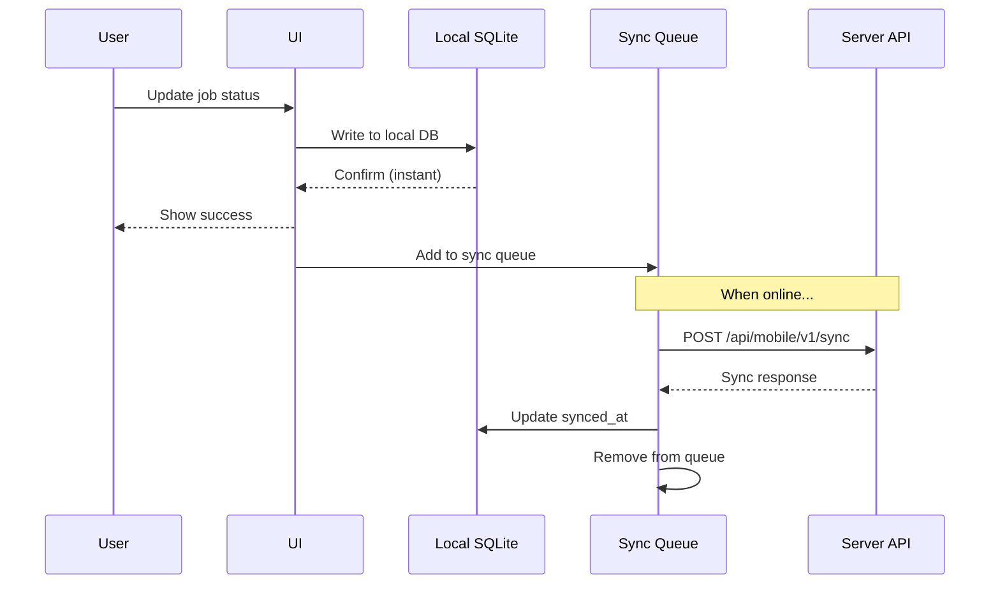

# Offline-First Synchronization Strategy

> **Status**: Planning  
> **Last Updated**: 2026-02-02  
> **Version**: 1.0  
> **Platform**: React Native Mobile App  

---

## Overview

The Workshop Management System mobile app uses an **offline-first architecture** that allows technicians to work without internet connectivity and automatically synchronizes data when connection is restored.

## Architecture Principles

### 1. Offline-First

- **Local database primary**: All reads happen from local SQLite
- **Background sync**: Network operations happen asynchronously
- **Optimistic UI**: Instant feedback, sync happens behind the scenes
- **Graceful degradation**: App fully functional offline with queued sync

### 2. Sync Strategy

- **Delta sync**: Only transfer changed data since last sync
- **Bidirectional**: Client → Server and Server → Client
- **Conflict resolution**: Last-write-wins with server authority
- **Incremental**: Continuous background synchronization

---

## Technology Stack

### Local Database: WatermelonDB

**Why WatermelonDB?**
- ✅ Built for React Native
- ✅ SQLite-based (fast, reliable)
- ✅ Lazy loading (performance)
- ✅ Reactive queries (real-time UI updates)
- ✅ Sync adapter built-in

**Schema Example**:

```javascript
// model/Job.js
import { Model } from '@nozbe/watermelondb'
import { field, date, readonly, relation } from '@nozbe/watermelondb/decorators'

export default class Job extends Model {
  static table = 'jobs'
  
  @field('job_number') jobNumber
  @field('status') status
  @field('customer_name') customerName
  @field('description') description
  @field('assigned_to_id') assignedToId
  @date('created_at') createdAt
  @date('updated_at') updatedAt
  @readonly @date('synced_at') syncedAt
  
  @relation('notes', 'job_id') notes
  @relation('photos', 'job_id') photos
}
```

### Sync Queue: AsyncStorage + NetInfo

- **Queue storage**: AsyncStorage for queued operations
- **Network detection**: NetInfo for connection status
- **Retry logic**: Exponential backoff algorithm

---

## Data Flow

### Offline Operation Flow



### Sync Operation Types

| Operation | Local Action | Queued for Sync | Server Endpoint |
|-----------|--------------|-----------------|-----------------|
| **View Job** | Read from SQLite | ❌ No | - |
| **Update Status** | Update  SQLite | ✅ Yes | PATCH /jobs/{id} |
| **Add Note** | Insert SQLite | ✅ Yes | POST /jobs/{id}/notes |
| **Upload Photo** | Store file path | ✅ Yes | POST /jobs/{id}/photos |
| **Fetch Latest** | - | ❌ No | GET /jobs?updated_since={timestamp} |

---

## Synchronization Process

### 1. Initial Sync (First Login)

```javascript
// Initial full sync on first login
async function performInitialSync(userId) {
  const response = await api.get('/api/mobile/v1/sync/initial', {
    params: { user_id: userId }
  })
  
  await database.action(async () => {
    // Batch create all records
    await jobsCollection.create(response.jobs)
    await customersCollection.create(response.customers)
    await notesCollection.create(response.notes)
  })
  
  await AsyncStorage.setItem('last_sync_at', response.server_time)
}
```

### 2. Delta Sync (Incremental Updates)

```javascript
// Incremental sync - only changed data
async function performDeltaSync() {
  const lastSyncAt = await AsyncStorage.getItem('last_sync_at')
  
  // 1. Push local changes to server
  const localChanges = await getUnsyncedChanges()
  const pushResponse = await api.post('/api/mobile/v1/sync', {
    operations: localChanges,
    last_sync_at: lastSyncAt
  })
  
  // 2. Pull server changes
  const pullResponse = await api.get('/api/mobile/v1/sync/pull', {
    params: { updated_since: lastSyncAt }
  })
  
  // 3. Merge changes into local DB
  await applyServerChanges(pullResponse)
  
  // 4. Mark local changes as synced
  await markAsSynced(localChanges)
  
  // 5. Update last sync timestamp
  await AsyncStorage.setItem('last_sync_at', pullResponse.server_time)
}
```

### 3. Background Sync

```javascript
// Background sync with expo-task-manager
import * as BackgroundFetch from 'expo-background-fetch'
import * as TaskManager from 'expo-task-manager'

const BACKGROUND_SYNC_TASK = 'background-sync-task'

TaskManager.defineTask(BACKGROUND_SYNC_TASK, async () => {
  const isConnected = await NetInfo.fetch().then(state => state.isConnected)
  
  if (isConnected) {
    try {
      await performDeltaSync()
      return BackgroundFetch.BackgroundFetchResult.NewData
    } catch (error) {
      return BackgroundFetch.BackgroundFetchResult.Failed
    }
  }
  
  return BackgroundFetch.BackgroundFetchResult.NoData
})

// Register background sync (runs every 15 minutes minimum)
await BackgroundFetch.registerTaskAsync(BACKGROUND_SYNC_TASK, {
  minimumInterval: 15 * 60, // 15 minutes
  stopOnTerminate: false,
  startOnBoot: true
})
```

---

## Conflict Resolution

### Strategy: Last-Write-Wins (Server Priority)

When conflicts occur (same record edited offline and on server):

**Resolution Rules**:
1. Compare `updated_at` timestamps
2. Server timestamp wins if conflict detected
3. Local changes preserved in conflict log for review
4. User notified of conflicts

**Example Conflict**:

```javascript
// Local change (offline)
{
  id: "job-uuid",
  status: "completed",
  updated_at: "2026-02-02T14:00:00Z" // Local time
}

// Server change (online)
{
  id: "job-uuid",
  status: "cancelled",
  updated_at: "2026-02-02T14:05:00Z" // Server time (later)
}

// Result: Server wins
// Local "completed" status overridden by server "cancelled"
// Conflict logged for user review
```

### Conflict Logging

```sql
CREATE TABLE conflict_log (
  id INTEGER PRIMARY KEY,
  entity_type TEXT NOT NULL,
  entity_id TEXT NOT NULL,
  local_value TEXT NOT NULL,
  server_value TEXT NOT NULL, 
  server_timestamp TEXT NOT NULL,
  resolved_at TEXT,
  created_at TEXT NOT NULL
);
```

---

## Queue Management

### Sync Queue Schema

```sql
CREATE TABLE sync_queue (
  id INTEGER PRIMARY KEY AUTOINCREMENT,
  operation_type TEXT NOT NULL, -- JOB_UPDATE, NOTE_CREATE, PHOTO_UPLOAD
  entity_type TEXT NOT NULL,
  entity_id TEXT NOT NULL,
  data TEXT NOT NULL, -- JSON payload
  retry_count INTEGER DEFAULT 0,
  max_retries INTEGER DEFAULT 5,
  created_at TEXT NOT NULL,
  attempted_at TEXT
);
```

### Queue Processing

```javascript
async function processSyncQueue() {
  const queueItems = await db.getAll('sync_queue', {
    where: { retry_count: { $lt: 5 } },
    orderBy: 'created_at ASC'
  })
  
  for (const item of queueItems) {
    try {
      await executeQueuedOperation(item)
      await db.delete('sync_queue', item.id)
    } catch (error) {
      // Increment retry count and use exponential backoff
      await db.update('sync_queue', item.id, {
        retry_count: item.retry_count + 1,
        attempted_at: new Date().toISOString()
      })
      
      // Calculate backoff delay
      const backoffDelay = Math.min(
        1000 * Math.pow(2, item.retry_count), // Exponential
        60000 // Max 60 seconds
      )
      await new Promise(resolve => setTimeout(resolve, backoffDelay))
    }
  }
}
```

### Exponential Backoff

| Retry | Delay |
|-------|-------|
| 1 | 2 seconds |
| 2 | 4 seconds |
| 3 | 8 seconds |
| 4 | 16 seconds |
| 5 | 32 seconds |
| 6+ | 60 seconds (max) |

---

## Photo Upload Strategy

### Deferred Upload

Large files (photos) handled separately:

1. **Capture photo** → Save to local file system
2. **Create photo record** → SQLite with local file:// path
3. **Queue upload** → Add to upload queue (separate from sync queue)
4. **Background upload** → WiFi-preferred upload when online
5. **Update record** → Replace local path with CDN URL

### Photo Queue

```javascript
// Photo upload queue with compression
async function queuePhotoUpload(jobId, photoUri) {
  // Compress image before queuing
  const compressedUri = await ImageManipulator.manipulateAsync(
    photoUri,
    [{ resize: { width: 1920 } }],
    { compress: 0.85, format: SaveFormat.JPEG }
  )
  
  // Create local photo record
  const photo = await photosCollection.create(localPhoto => {
    localPhoto.jobId = jobId
    localPhoto.localUri = compressedUri
    localPhoto.status = 'pending_upload'
    localPhoto.takenAt = new Date()
  })
  
  // Queue for upload
  await addToUploadQueue({
    type: 'PHOTO_UPLOAD',
    photoId: photo.id,
    uri: compressedUri,
    jobId: jobId
  })
}

// Process photo uploads (WiFi preferred)
async function processPhotoUploads() {
  const netInfo = await NetInfo.fetch()
  
  // Only upload on WiFi unless critical
  if (!netInfo.isWifiEnabled && !force) {
    return
  }
  
  const pendingUploads = await getPhotoUploadQueue()
  
  for (const upload of pendingUploads) {
    try {
      const formData = new FormData()
      formData.append('photo', {
        uri: upload.uri,
        type: 'image/jpeg',
        name: 'photo.jpg'
      })
      
      const response = await api.post(
        `/api/mobile/v1/jobs/${upload.jobId}/photos`,
        formData
      )
      
      // Update photo with server URL
      await database.get('photos').find(upload.photoId).update(photo => {
        photo.url = response.url
        photo.thumbnailUrl = response.thumbnail_url
        photo.status = 'uploaded'
      })
      
    } catch (error) {
      // Retry later
    }
  }
}
```

---

## Network State Handling

### Connection Detection

```javascript
import NetInfo from '@react-native-community/netinfo'

// Subscribe to network state
const unsubscribe = NetInfo.addEventListener(state => {
  if (state.isConnected) {
    // Now online - trigger sync
    performDeltaSync()
    processPhotoUploads()
  } else {
    // Now offline - show indicator
    showOfflineIndicator()
  }
})
```

### UI Indicators

- **Online**: Green dot in header
- **Offline**: Red dot + "Working Offline" banner
- **Syncing**: Orange dot + progress indicator
- **Queue count**: Badge showing pending operations

---

## Sync Monitoring

### Metrics Tracked

- Last successful sync timestamp
- Pending operations count
- Failed operations count
- Average sync duration
- Photo upload queue size

### User-Facing Sync Status

```javascript
// Sync status component
function SyncStatus() {
  const lastSync = useSyncStore(state => state.lastSyncAt)
  const pendingCount = useSyncStore(state => state.pendingCount)
  
  return (
    <View>
      <Text>Last synced: {formatRelative(lastSync)}</Text>
      {pendingCount > 0 && (
        <Text>{pendingCount} changes pending</Text>
      )}
    </View>
  )
}
```

---

## Performance Optimization

### Batch Operations

- Group multiple DB writes in single transaction
- Combine API requests where possible
- Debounce rapid user actions

### Pagination

- Lazy load job lists (20 items per page)
- Infinite scroll with cursor-based pagination
- Cache frequently accessed items

### Memory Management

- Limit in-memory cache size
- Unload inactive screens
- Compress images before storing

---

## Testing Strategy

### Offline Scenarios

1. **Complete offline**
   - Airplane mode testing
   - All CRUD operations queued
   - Verify eventual sync

2. **Intermittent connectivity**
   - Random network drops
   - Partial sync completion
   - Resume handling

3. **Conflict scenarios**
   - Same record edited offline and online
   - Verify conflict resolution
   - User notification

4. **Photo uploads**
   - Large file handling
   - WiFi vs cellular behavior
   - Upload failure recovery

---

## Related Documentation

- [Mobile API Design](13-mobile-api-design.md) - REST API endpoints
- [Mobile Application PRD](11-mobile-prd.md) - Mobile app requirements
- [PWA Requirement](09-pwa-requirement.md) - Alternative PWA approach
