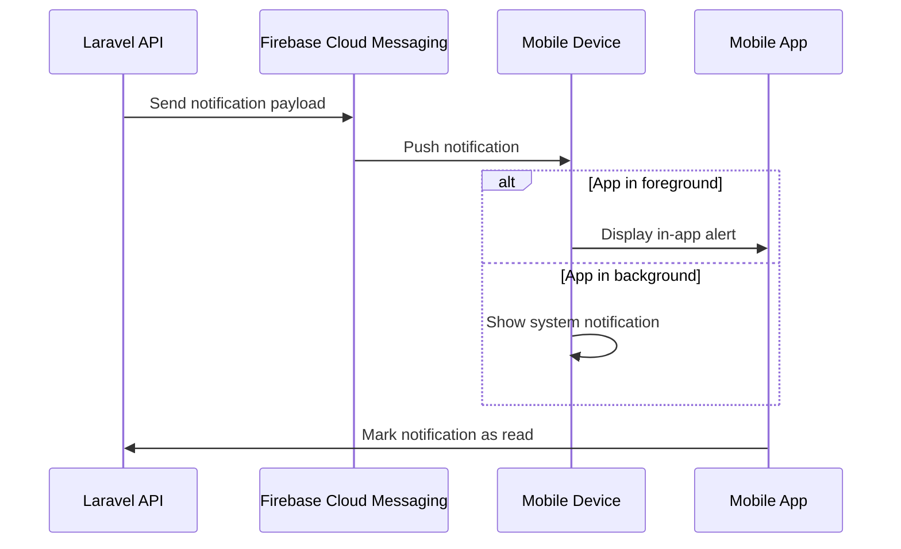

# Push Notification Architecture

> **Status**: Planned (notification delivery not implemented in this repository)  
> **Last Updated**: 2026-02-02  
> **Version**: 1.0  
> **Platform**: Firebase Cloud Messaging (FCM)  

---

## Overview

The Workshop Management System uses **Firebase Cloud Messaging (FCM)** to deliver real-time push notifications to mobile devices for critical events like job assignments, status updates, and deadline reminders.

## Technology Stack

### Firebase Cloud Messaging (FCM)

**Capabilities**:
- ✅ Cross-platform (iOS + Android)
- ✅ High reliability and delivery rate
- ✅ Free tier (unlimited notifications)
- ✅ Rich notifications (images, actions)
- ✅ Background and foreground handling

**Integration**:
- Laravel backend: `laravel-notification-channels/fcm`
- React Native: `@react-native-firebase/messaging`

---

## Architecture

### Notification Flow



---

## Device Registration

### FCM Token Management

**On App Install / Login**:

```javascript
// Mobile app registers FCM token
import messaging from '@react-native-firebase/messaging'

async function registerDevice() {
  const fcmToken = await messaging().getToken()
  const deviceId = await DeviceInfo.getUniqueId()
  
  await api.post('/api/mobile/v1/devices/register', {
    device_id: deviceId,
    fcm_token: fcmToken,
    platform: Platform.OS, // 'ios' or 'android'
    device_name: await DeviceInfo.getDeviceName(),
    app_version: DeviceInfo.getVersion()
  })
}
```

**Server-Side Device Table**:

```sql
CREATE TABLE device_registrations (
  id UUID PRIMARY KEY,
  user_id UUID NOT NULL REFERENCES users(id) ON DELETE CASCADE,
  device_id VARCHAR(255) NOT NULL UNIQUE,
  fcm_token TEXT NOT NULL,
  platform VARCHAR(10) NOT NULL, -- 'ios' or 'android'
  device_name VARCHAR(255),
  app_version VARCHAR(20),
  last_active_at TIMESTAMP,
  created_at TIMESTAMP NOT NULL,
  updated_at TIMESTAMP NOT NULL,
  
  INDEX idx_user_devices (user_id),
  INDEX idx_fcm_token (fcm_token)
);
```

### Token Refresh

FCM tokens can expire or change:

```javascript
// Listen for token refresh
messaging().onTokenRefresh(async newToken => {
  const deviceId = await DeviceInfo.getUniqueId()
  
  await api.put(`/api/mobile/v1/devices/${deviceId}`, {
    fcm_token: newToken
  })
})
```

---

## Notification Types

### 1. Job Assignment

Notify technician when a job is assigned to them.

**Trigger**: Job assigned to user

**Laravel Event**:

```php
// app/Events/JobAssigned.php
class JobAssigned extends Event
{
    public function __construct(public Job $job) {}
}

// app/Listeners/SendJobAssignedNotification.php
class SendJobAssignedNotification
{
    public function handle(JobAssigned $event)
    {
        $technician = $event->job->assignedTo;
        
        $technician->notify(new JobAssignedNotification($event->job));
    }
}
```

**Notification Class**:

```php
// app/Notifications/JobAssignedNotification.php
use NotificationChannels\Fcm\FcmChannel;
use NotificationChannels\Fcm\FcmMessage;

class JobAssignedNotification extends Notification
{
    public function via($notifiable): array
    {
        return [FcmChannel::class, 'database'];
    }
    
    public function toFcm($notifiable): FcmMessage
    {
        return (new FcmMessage(notification: new \NotificationChannels\Fcm\Resources\Notification(
            title: 'New Job Assigned',
            body: "Job {$this->job->job_number}: {$this->job->description}",
            image: $this->job->customer->avatar_url,
        )))
        ->data([
            'type' => 'job_assigned',
            'job_id' => $this->job->id,
            'job_number' => $this->job->job_number,
            'action' => 'view_job'
        ])
        ->android(
            (new \NotificationChannels\Fcm\Resources\AndroidConfig())
                ->priority('high')
                ->notification(
                    (new \NotificationChannels\Fcm\Resources\AndroidNotification())
                        ->sound('default')
                        ->clickAction('VIEW_JOB')
                )
        )
        ->apns(
            (new \NotificationChannels\Fcm\Resources\ApnsConfig())
                ->payload(['aps' => ['sound' => 'default', 'badge' => 1]])
        );
    }
    
    public function toDatabase($notifiable): array
    {
        return [
            'type' => 'job_assigned',
            'job_id' => $this->job->id,
            'job_number' => $this->job->job_number,
            'message' => "New job assigned: {$this->job->job_number}",
            'read_at' => null
        ];
    }
}
```

### 2. Job Status Update

Notify relevant users when job status changes.

**Payload**:

```json
{
  "notification": {
    "title": "Job Status Updated",
    "body": "WJ-20260202-0001 is now Completed"
  },
  "data": {
    "type": "job_status_changed",
    "job_id": "uuid",
    "old_status": "in_progress",
    "new_status": "completed",
    "action": "view_job"
  }
}
```

### 3. Approval Request (KEW.PA-10)

Notify inspectors/approvers of pending reviews.

**Payload**:

```json
{
  "notification": {
    "title": "Approval Required",
    "body": "KEW.PA-10 form #12345 awaits your inspection"
  },
  "data": {
    "type": "approval_request",
    "job_id": "uuid",
    "form_type": "KEW.PA-10",
    "action": "review_form"
  }
}
```

### 4. Deadline Reminder

Remind technicians of upcoming job deadlines.

**Scheduled Notification**:

```php
// Scheduled daily at 9:00 AM
$upcomingJobs = Job::where('assigned_to_id', $technician->id)
    ->where('due_date', Carbon::today()->addDay())
    ->where('status', '!=', 'completed')
    ->get();

foreach ($upcomingJobs as $job) {
    $technician->notify(new JobDeadlineReminderNotification($job));
}
```

**Payload**:

```json
{
  "notification": {
    "title": "Deadline Tomorrow",
    "body": "Job WJ-20260202-0001 is due tomorrow"
  },
  "data": {
    "type": "deadline_reminder",
    "job_id": "uuid",
    "due_date": "2026-02-03",
    "action": "view_job"
  }
}
```

---

## Mobile App Handling

### Foreground Notifications

```javascript
// App is active - show in-app alert
messaging().onMessage(async remoteMessage => {
  Alert.alert(
    remoteMessage.notification.title,
    remoteMessage.notification.body,
    [
      { text: 'Dismiss', style: 'cancel' },
      {
        text: 'View',
        onPress: () => handleNotificationAction(remoteMessage.data)
      }
    ]
  )
})
```

### Background Notifications

```javascript
// App is in background - handle tap
messaging().onNotificationOpenedApp(remoteMessage => {
  handleNotificationAction(remoteMessage.data)
})

// App was quit - handle tap that opened app
messaging()
  .getInitialNotification()
  .then(remoteMessage => {
    if (remoteMessage) {
      handleNotificationAction(remoteMessage.data)
    }
  })
```

### Notification Actions

```javascript
function handleNotificationAction(data) {
  switch (data.type) {
    case 'job_assigned':
    case 'job_status_changed':
    case 'deadline_reminder':
      // Navigate to job detail screen
      navigation.navigate('JobDetail', { jobId: data.job_id })
      break
      
    case 'approval_request':
      // Navigate to KEW.PA-10 review screen
      navigation.navigate('ApprovalReview', { jobId: data.job_id })
      break
      
    default:
      // Navigate to notifications list
      navigation.navigate('Notifications')
  }
  
  // Mark as read
  markNotificationAsRead(data.notification_id)
}
```

---

## Notification Storage

### Database Persistence

Store all notifications for in-app notification center:

```sql
CREATE TABLE notifications (
  id UUID PRIMARY KEY,
  user_id UUID NOT NULL REFERENCES users(id) ON DELETE CASCADE,
  type VARCHAR(50) NOT NULL,
  title VARCHAR(255) NOT NULL,
  body TEXT NOT NULL,
  data JSONB,
  read_at TIMESTAMP,
  created_at TIMESTAMP NOT NULL,
  
  INDEX idx_user_notifications (user_id, created_at DESC),
  INDEX idx_unread (user_id, read_at) WHERE read_at IS NULL
);
```

### In-App Notification Center

```javascript
// Mobile app fetches notification history
async function loadNotifications() {
  const response = await api.get('/api/mobile/v1/notifications', {
    params: {
      unread_only: false,
      limit: 50
    }
  })
  
  return response.data
}

// Mark as read
async function markAsRead(notificationId) {
  await api.patch(`/api/mobile/v1/notifications/${notificationId}/read`)
}
```

---

## Permission Handling

### Request Notification Permission

```javascript
async function requestNotificationPermission() {
  const authStatus = await messaging().requestPermission()
  
  const enabled =
    authStatus === messaging.AuthorizationStatus.AUTHORIZED ||
    authStatus === messaging.AuthorizationStatus.PROVISIONAL
  
  if (enabled) {
    // Permission granted - register device
    await registerDevice()
  } else {
    // Permission denied - show explanation
    showPermissionRequiredAlert()
  }
}
```

### iOS-Specific: Provisional Authorization

```javascript
// iOS only - show notifications silently initially
await messaging().requestPermission({
  provisional: true // Silent notifications in Notification Center
})
```

---

## Notification Settings

### User Preferences

Allow users to customize notification settings:

```javascript
// User notification preferences
const notificationSettings = {
  job_assigned: true,
  job_status_changed: true,
  approval_request: true,
  deadline_reminder: true,
  marketing: false
}

// Save to server
await api.put('/api/mobile/v1/settings/notifications', notificationSettings)
```

**Server-Side Preference Table**:

```sql
CREATE TABLE notification_preferences (
  user_id UUID PRIMARY KEY REFERENCES users(id) ON DELETE CASCADE,
  job_assigned BOOLEAN DEFAULT TRUE,
  job_status_changed BOOLEAN DEFAULT TRUE,
  approval_request BOOLEAN DEFAULT TRUE,
  deadline_reminder BOOLEAN DEFAULT TRUE,
  marketing BOOLEAN DEFAULT FALSE,
  updated_at TIMESTAMP NOT NULL
);
```

### Checking Before Sending

```php
// Check user preferences before sending
if ($user->notificationPreferences->job_assigned) {
    $user->notify(new JobAssignedNotification($job));
}
```

---

## Analytics & Monitoring

### Track Notification Metrics

```sql
CREATE TABLE notification_logs (
  id BIGSERIAL PRIMARY KEY,
  notification_id UUID REFERENCES notifications(id),
  user_id UUID REFERENCES users(id),
  fcm_message_id VARCHAR(255),
  status VARCHAR(20), -- sent, delivered, opened, failed
  error_message TEXT,
  sent_at TIMESTAMP NOT NULL,
  delivered_at TIMESTAMP,
  opened_at TIMESTAMP
);
```

### Key Metrics

- **Delivery rate**: % of notifications successfully delivered
- **Open rate**: % of notifications opened by users
- **Response time**: Time between notification and user action
- **Failure rate**: % of failed notifications

---

## Best Practices

### 1. Notification Content

- ✅ **Clear and concise** titles (< 50 chars)
- ✅ **Actionable** body text with context
- ✅ **Relevant** to user's role and permissions
- ❌ Avoid spamming users with excessive notifications

### 2. Timing

- ⏰ **Business hours** for non-urgent notifications
- 🚨 **Immediate** for critical assignments/approvals
- 📅 **Scheduled reminders** at appropriate times (9 AM for deadlines)

### 3. Grouping

- 📚 **Group similar** notifications (e.g., "3 new job assignments")
- 🔔 **Collapse** old notifications to avoid clutter

### 4. Testing

- ✅ Test on both iOS and Android
- ✅ Test foreground, background, and killed app states
- ✅ Verify deep linking works correctly
- ✅ Monitor delivery rates

---

## Troubleshooting

### Common Issues

**1. Notifications not received**
- Check FCM token is valid and registered
- Verify Firebase project configuration
- Check notification permissions granted
- Test with FCM debug console

**2. App not opening from notification**
- Verify deep link configuration
- Check notification data payload
- Test background vs foreground states

**3. iOS-specific issues**
- APNs certificate configured correctly
- Push Notification capability enabled in Xcode
- Background modes enabled

**4. Android-specific issues**
- Google Services JSON file included
- Notification channel configured (Android 8+)
- Battery optimization disabled for app

---

## Related Documentation

- [Mobile Application PRD](11-mobile-prd.md) - Mobile app requirements
- [Mobile API Design](13-mobile-api-design.md) - REST API endpoints
- [Offline Sync Strategy](14-offline-sync.md) - Data synchronization
