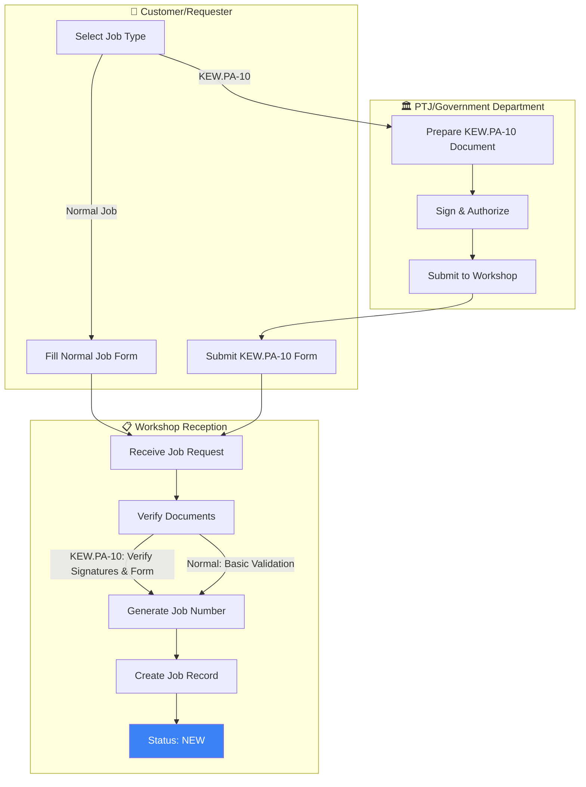
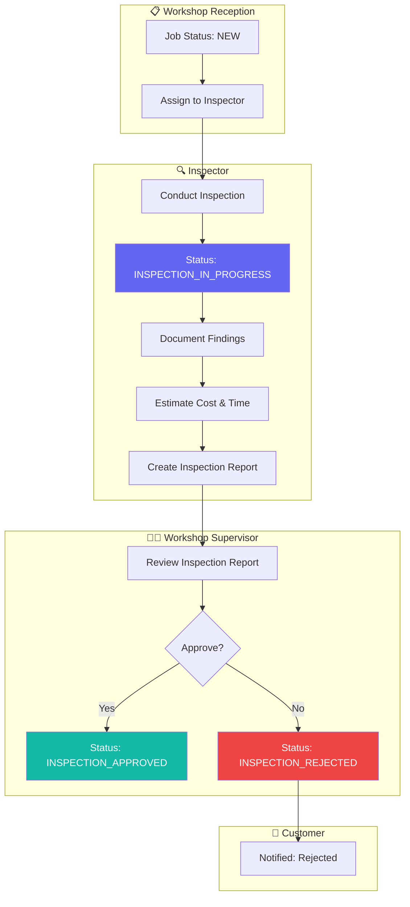
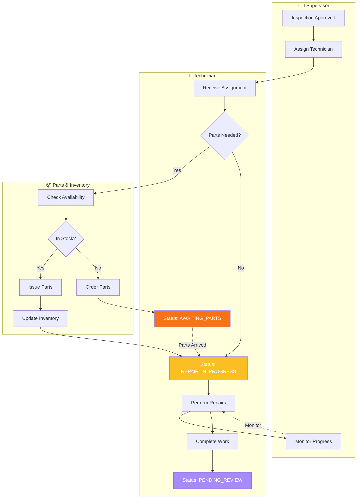
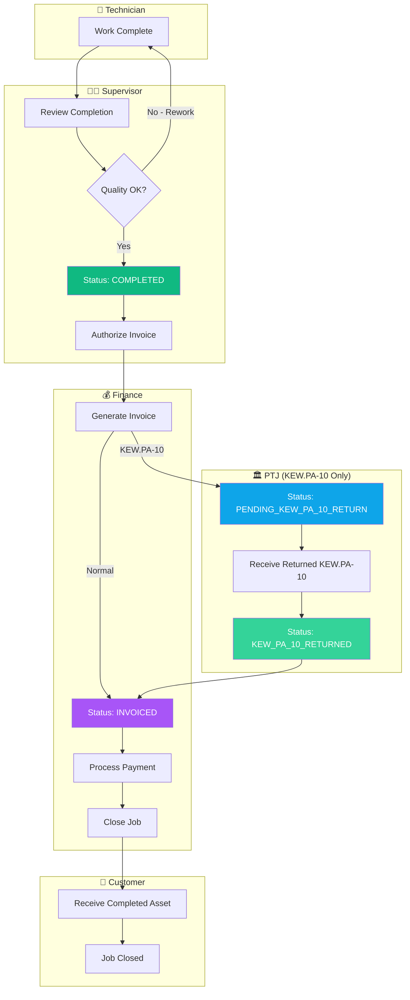
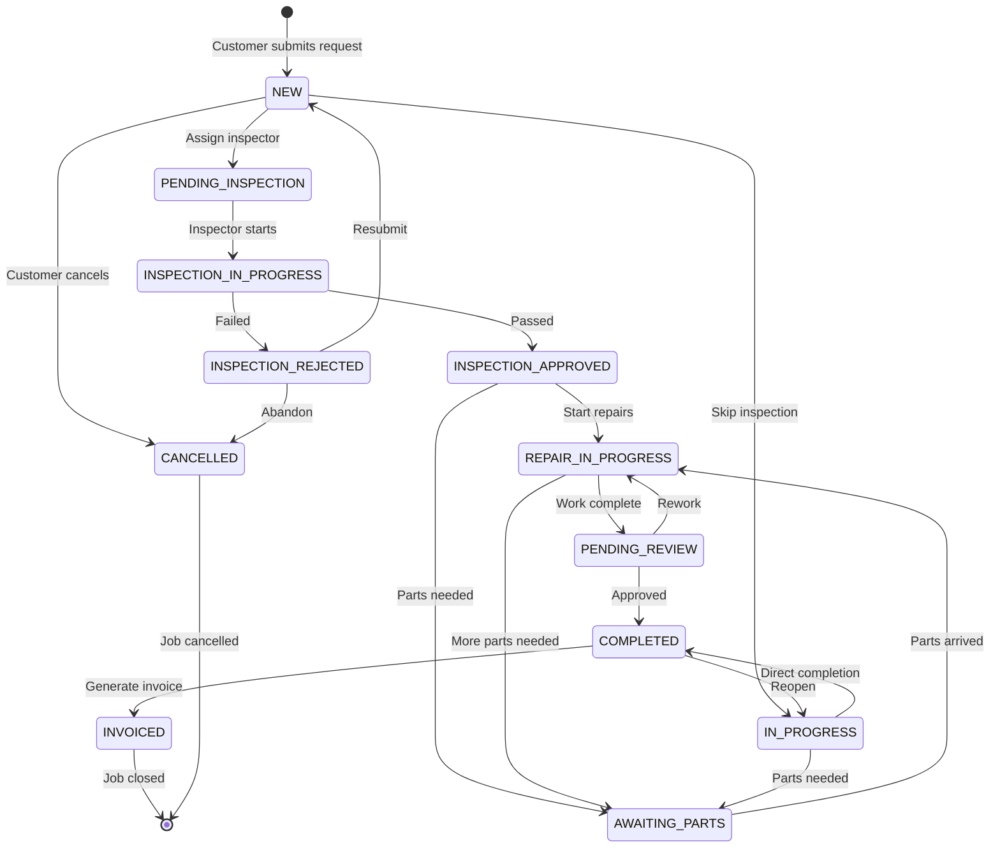
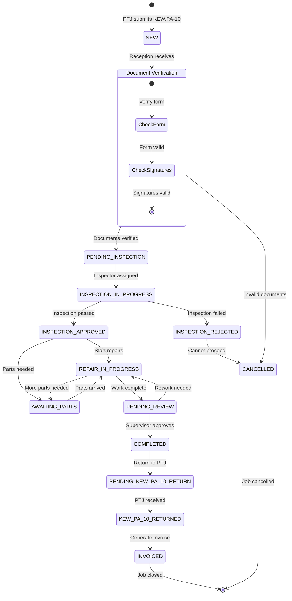
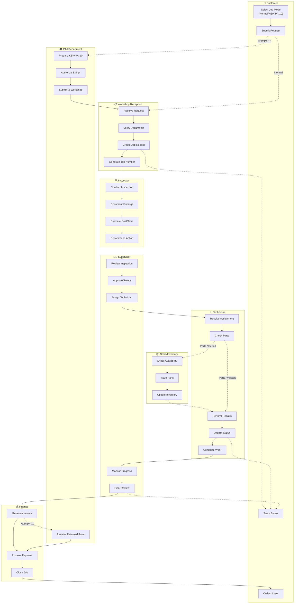

# Job Request Workflow - Swimlane Diagrams

This document illustrates the complete workflow for job requests in the Government Workshop Management System, showing both **Normal Jobs** and **KEW.PA-10 Jobs**.

**Last Updated**: 2026-02-04  
**Status**: Active  
**Related Documents**:
- [Simplified Job Modes](./16-simplified-job-modes.md)
- [ERD Simplified](./erd-simplified.md)
- [Workflow Option 2](./08-workflow-option-2.md)

---

## Complete Job Request Swimlane (By Phase)

> [!TIP]
> The workflow is broken into 4 phases for better readability. Use the carousel to navigate through each phase.

````carousel
### Phase 1: Job Initiation & Reception



**Key Activities:**
- Customer selects job type (Normal or KEW.PA-10)
- KEW.PA-10 requires PTJ authorization and signatures
- Reception verifies documents and creates job record
- Job status: **NEW**

<!-- slide -->

### Phase 2: Inspection & Approval



**Key Activities:**
- Inspector conducts physical inspection
- Documents findings, estimates cost and time
- Supervisor reviews and approves/rejects
- Job status: **PENDING_INSPECTION** → **INSPECTION_IN_PROGRESS** → **INSPECTION_APPROVED/REJECTED**

<!-- slide -->

### Phase 3: Repair & Parts Management



**Key Activities:**
- Supervisor assigns technician
- Technician checks parts availability
- If parts needed, job waits (AWAITING_PARTS)
- Repairs performed and work completed
- Job status: **INSPECTION_APPROVED** → **AWAITING_PARTS** (if needed) → **REPAIR_IN_PROGRESS** → **PENDING_REVIEW**

<!-- slide -->

### Phase 4: Completion & Invoicing



**Key Activities:**
- Supervisor reviews completed work
- If approved, authorizes invoice
- **KEW.PA-10 jobs**: Must return form to PTJ before invoicing
- **Normal jobs**: Direct to invoicing
- Payment processed and job closed
- Job status: **PENDING_REVIEW** → **COMPLETED** → **PENDING_KEW_PA_10_RETURN** (KEW only) → **KEW_PA_10_RETURNED** (KEW only) → **INVOICED**
````

---

## Detailed Status Flow by Job Type

### Normal Job Workflow



### KEW.PA-10 Job Workflow



---

## Swimlane by Responsibility



---

## Key Differences: Normal vs KEW.PA-10

| Aspect | Normal Job | KEW.PA-10 Job |
|--------|-----------|---------------|
| **Initiator** | Customer directly | PTJ/Government Department |
| **Documentation** | Basic job form | Official KEW.PA-10 form with signatures |
| **Verification** | Minimal | Strict document & signature verification |
| **Priority** | Low/Medium/High | Urgent/High/Medium/Low (KewPa10Priority) |
| **Completion** | Direct to invoicing | Must return KEW.PA-10 to PTJ first |
| **Status Flow** | NEW → ... → COMPLETED → INVOICED | NEW → ... → COMPLETED → PENDING_KEW_PA_10_RETURN → KEW_PA_10_RETURNED → INVOICED |
| **Fields** | Standard job fields | Additional KEW-specific fields (inspector IC, findings, recommendations) |

---

## Critical Handoff Points

> [!IMPORTANT]
> **Key handoff points where delays commonly occur:**

1. **PTJ → Workshop**: KEW.PA-10 document preparation and submission
2. **Reception → Inspector**: Job assignment and prioritization
3. **Inspector → Supervisor**: Inspection report review and approval
4. **Supervisor → Technician**: Work assignment and parts availability
5. **Technician → Store**: Parts requisition and inventory management
6. **Completion → Finance**: Invoice generation and payment processing
7. **Finance → PTJ**: KEW.PA-10 document return (KEW jobs only)

---

## Status Tracking Points

Customers can track their job at these key milestones:

- ✅ **Job Created** - Job number assigned
- 🔍 **Inspection Scheduled** - Inspector assigned
- 📋 **Inspection Complete** - Report generated
- ✅ **Approved for Repair** - Work authorized
- 🔧 **Repair in Progress** - Technician working
- ⏸️ **Awaiting Parts** - Inventory delay
- ✅ **Work Completed** - Ready for review
- 💰 **Invoiced** - Payment processing
- 🏁 **Closed** - Asset returned

---

## System Implementation Notes

### Database Schema
- **Job Mode**: `job_mode` enum (NORMAL, KEW_PA_10)
- **Status Tracking**: `status` enum with 14 states
- **KEW Fields**: Dedicated columns for KEW.PA-10 data
- **Audit Trail**: `JobStatusHistory` and `JobAssignment` tables

### Controllers
- [JobController.php](file:///c:/Users/zuraidiismail/RnD/workshop/app/Http/Controllers/JobController.php) - Main job CRUD operations
- [JobAnalyticsController.php](file:///c:/Users/zuraidiismail/RnD/workshop/app/Http/Controllers/JobAnalyticsController.php) - Reporting and analytics

### Models
- [WorkshopJob.php](file:///c:/Users/zuraidiismail/RnD/workshop/app/Models/WorkshopJob.php) - Core job model with mode-specific methods
- [JobStatus.php](file:///c:/Users/zuraidiismail/RnD/workshop/app/Enums/JobStatus.php) - Status enum with transition rules

### Frontend Components
- Job creation forms (Normal and KEW.PA-10)
- Status tracking dashboard
- Timeline view for job history
- Inspector and technician assignment interfaces
