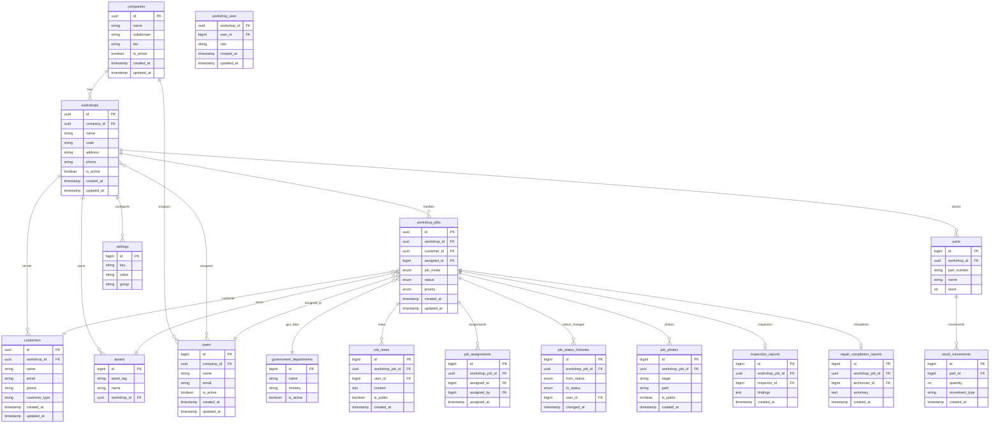

# Simplified ERD - Current Schema

> **Version**: 3.0.1
> **Last Updated**: 2026-02-07
> **Status**: Current

---

## Overview

This ERD reflects the current database schema used by the Laravel application. It focuses on the core domain tables and omits framework tables (cache, queue) and Spatie permission tables for readability.

---

## ERD Diagram (Core Domain)

---

## Notes

- KEW.PA-10 fields are stored directly on `workshop_jobs`
- Spatie permission tables are not shown here
- Queue and cache tables are not shown here

---

**Reference**: See `database/migrations` for full schema details.
