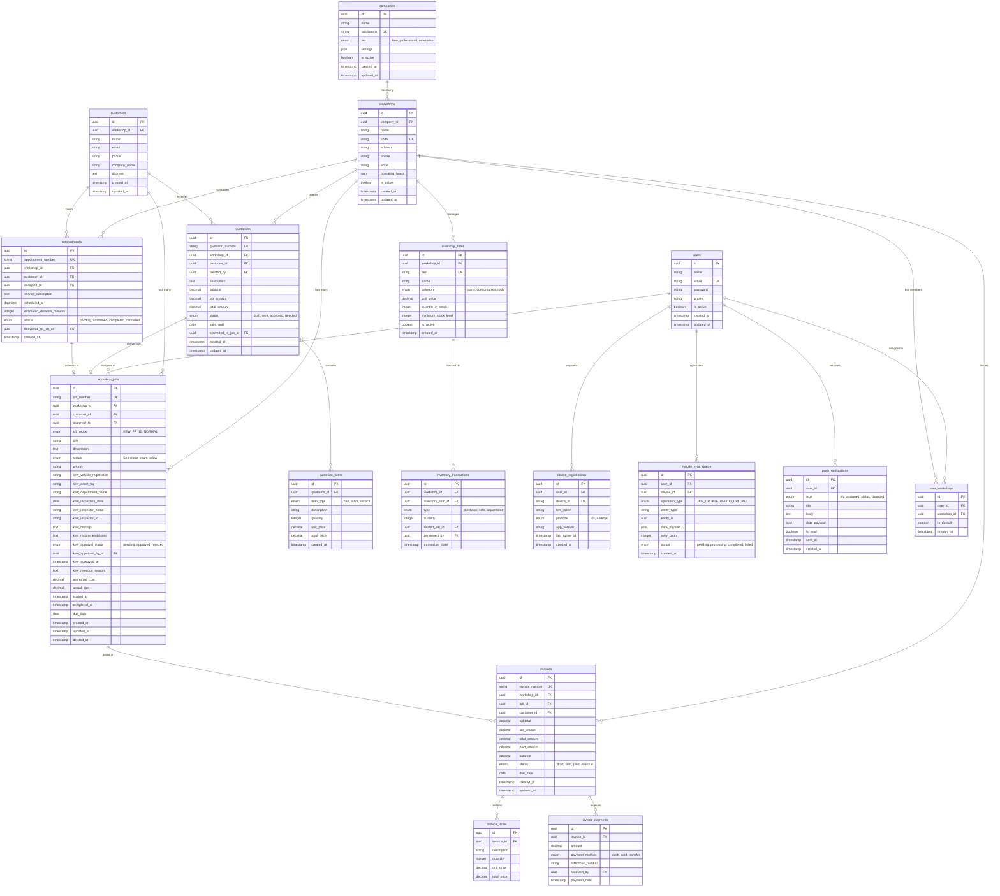

# Simplified ERD - Non-Dynamic Architecture

> **Version**: 3.0.0-simplified  
> **Last Updated**: 2026-02-02  
> **Status**: Proposed - Workflow & Templates Removed  

---

## Overview

This ERD reflects the **simplified architecture** without dynamic workflow engine or template system.

**Key Changes**:
- ❌ **Removed**: 8 workflow/template tables
- ✅ **Added**: Static KEW.PA-10 fields to `workshop_jobs`
- ✅ **Simplified**: Job mode enum (KEW_PA_10 | NORMAL)
- ✅ **Retained**: Multi-tenant, quotations, invoices, inventory, appointments, mobile

---

## Simplified Architecture Diagram



---

## Status Enum Definition

### Simplified Status Flow (No Workflow Engine)

```php
// app/Enums/JobStatus.php
enum JobStatus: string
{
    // Common statuses
    case DRAFT = 'draft';
    case PENDING = 'pending';
    case IN_PROGRESS = 'in_progress';
    case COMPLETED = 'completed';
    case CANCELLED = 'cancelled';
    
    // KEW.PA-10 specific statuses
    case KEW_INSPECTION = 'kew_inspection';
    case KEW_APPROVAL_PENDING = 'kew_approval_pending';
    case KEW_APPROVED = 'kew_approved';
    case KEW_REJECTED = 'kew_rejected';
}
```

**Status Transition Rules** (Hardcoded):

#### KEW.PA-10 Jobs:
```
draft → kew_inspection → kew_approval_pending → kew_approved → in_progress → completed
                                              ↓
                                         kew_rejected → (can return to kew_inspection)
```

#### Normal Jobs:
```
draft → pending → in_progress → completed
              ↓
          cancelled
```

---

## Tables Removed (8 tables)

The following tables from the old dynamic architecture are **removed**:

### Workflow Engine (4 tables)
```sql
❌ workflows
   - id, name, code, description, is_active, metadata

❌ workflow_statuses  
   - id, workflow_id, name, code, is_initial, is_final, display_order

❌ workflow_transitions
   - id, workflow_id, from_status_id, to_status_id, conditions, actions

❌ workflow_rules
   - id, workflow_id, status_id, rule_type, conditions, actions
```

### Template System (4 tables)
```sql
❌ form_templates
   - id, name, description, template_json

❌ form_template_fields
   - id, template_id, field_name, field_type, validation_rules

❌ form_template_sections
   - id, template_id, section_name, display_order

❌ job_form_data
   - id, job_id, template_id, form_data_json
```

---

## Table Descriptions

### Core Tables

#### `workshop_jobs`
Central job entity with **static KEW.PA-10 fields** instead of dynamic templates.

**Key Fields**:
- `job_mode`: Enum (`KEW_PA_10` | `NORMAL`)
- `status`: Simple enum (no workflow engine)
- `kew_*` fields: Static government job fields (NULL for normal jobs)

**Business Logic**:
- Status transitions: Hardcoded in `JobStatusService`
- No runtime configuration
- Form structure: Fixed Vue components

#### `companies` & `workshops`
Multi-tenant hierarchy remains unchanged.

#### `quotations` & `invoices`
Workshop feature tables remain unchanged.

#### `inventory_items` & `appointments`
Workshop feature tables remain unchanged.

### Mobile Tables

#### `device_registrations`
Mobile device FCM token management.

#### `mobile_sync_queue`
Offline sync queue (simplified without template parsing).

#### `push_notifications`
Push notification history.

---

## Index Strategy

```sql
-- Performance indexes
CREATE INDEX idx_jobs_workshop_mode_status 
  ON workshop_jobs(workshop_id, job_mode, status);

CREATE INDEX idx_jobs_kew_approval 
  ON workshop_jobs(kew_approval_status, kew_approved_at) 
  WHERE job_mode = 'KEW_PA_10';

CREATE INDEX idx_jobs_assigned 
  ON workshop_jobs(assigned_to, status);

CREATE INDEX idx_sync_queue_status 
  ON mobile_sync_queue(status, created_at);
```

---

## Migration Notes

### Data Migration Strategy

```sql
-- 1. Archive old tables
CREATE TABLE _archive_workflows AS SELECT * FROM workflows;
CREATE TABLE _archive_workflow_statuses AS SELECT * FROM workflow_statuses;
-- ... archive all 8 tables

-- 2. Migrate dynamic form data to static fields
UPDATE workshop_jobs j
INNER JOIN job_form_data fd ON j.id = fd.job_id
SET 
  j.kew_vehicle_registration = JSON_UNQUOTE(JSON_EXTRACT(fd.form_data_json, '$.vehicle_registration')),
  j.kew_asset_tag = JSON_UNQUOTE(JSON_EXTRACT(fd.form_data_json, '$.asset_tag')),
  j.kew_findings = JSON_UNQUOTE(JSON_EXTRACT(fd.form_data_json, '$.findings'))
WHERE j.job_mode = 'KEW_PA_10';

-- 3. Drop old columns
ALTER TABLE workshop_jobs 
  DROP COLUMN template_id,
  DROP COLUMN workflow_id,
  DROP COLUMN current_workflow_status_id;

-- 4. Drop old tables
DROP TABLE workflow_rules;
DROP TABLE workflow_transitions;
DROP TABLE workflow_statuses;
DROP TABLE workflows;
DROP TABLE job_form_data;
DROP TABLE form_template_fields;
DROP TABLE form_templates;
```

---

## Total Tables

| Domain | Count | Tables |
|--------|-------|--------|
| Multi-Tenant | 3 | companies, workshops, user_workshops |
| Core Jobs | 2 | workshop_jobs, customers |
| Quotations | 2 | quotations, quotation_items |
| Invoices | 3 | invoices, invoice_items, invoice_payments |
| Inventory | 2 | inventory_items, inventory_transactions |
| Appointments | 2 | appointments, appointment_slots |
| Mobile | 3 | device_registrations, mobile_sync_queue, push_notifications |
| Users | 1 | users |
| **Total** | **18 tables** | Down from 26+ tables |

**Reduction**: ~8 tables removed (workflow + templates)

---

## Related Documentation

- [Architecture Redesign Plan](file:///C:/Users/zuraidiismail/.gemini/antigravity/brain/c2bfc08a-4fde-4d78-84d0-6de5c361a30c/architecture-redesign.md)
- [Job Mode System](../02-architecture/16-simplified-job-modes.md) *(to be created)*
- [Migration Guide](../05-deployment/04-workflow-removal-migration.md) *(to be created)*

---

**Approved By**: _Pending approval_  
**Implementation Status**: Proposed
