# Entity Relationship Diagram (ERD)

> **Last Updated**: 2026-01-07

This document provides a comprehensive Entity Relationship Diagram (ERD) for the Workshop Management System. The diagram illustrates all database entities, their attributes, and the relationships between them.

## Overview

The Workshop Management System is built around a **Job-centric architecture** with the following key domains:

- **Core**: Workshop jobs, customers, and assets
- **Workflow**: Dynamic workflow engine with statuses, transitions, and rules
- **Templates**: Dynamic form templates with configurable fields
- **User Management**: Users, roles, and permissions
- **Reporting**: Inspection reports, completion reports, and job documentation

---

## ERD Diagram

```mermaid
erDiagram
    %% ============================================
    %% CORE DOMAIN
    %% ============================================

    users {
        bigint id PK
        string name
        string email UK
        string password
        string role
        string phone
        string department
        timestamp email_verified_at
        timestamp two_factor_confirmed_at
        timestamp created_at
        timestamp updated_at
    }

    customers {
        bigint id PK
        string name
        string email
        string phone
        string company_name
        string ic_number
        text address
        string city
        string state
        string postcode
        string customer_type
        string department
        text notes
        timestamp deleted_at
        timestamp created_at
        timestamp updated_at
    }

    government_departments {
        bigint id PK
        string name
        string department_code
        string ministry
        string contact_person
        string email
        string phone
        text address
        string city
        string state
        string postcode
        boolean is_active
        timestamp created_at
        timestamp updated_at
    }

    assets {
        bigint id PK
        bigint government_department_id FK
        string asset_tag
        string asset_type
        string asset_name
        text description
        string location
        string current_condition
        date last_maintenance_date
        timestamp created_at
        timestamp updated_at
    }

    workshop_jobs {
        bigint id PK
        string job_number UK
        string job_reference
        bigint template_id FK
        bigint workflow_id FK
        bigint current_workflow_status_id FK
        bigint customer_id FK
        bigint government_department_id FK
        bigint asset_id FK
        bigint assigned_to FK
        string title
        text description
        string status
        string priority
        string vehicle_registration
        string asset_tag
        decimal estimated_cost
        decimal actual_cost
        timestamp started_at
        timestamp completed_at
        timestamp invoiced_at
        date due_date
        boolean inspection_required
        boolean inspection_approved
        date estimated_completion_date
        timestamp kew_pa_10_returned_at
        decimal estimated_hours
        decimal actual_hours
        timestamp deleted_at
        timestamp created_at
        timestamp updated_at
    }

    %% ============================================
    %% WORKFLOW DOMAIN
    %% ============================================

    workflows {
        bigint id PK
        string name
        string code UK
        text description
        boolean is_active
        boolean is_default
        json metadata
        bigint created_by FK
        bigint updated_by FK
        timestamp deleted_at
        timestamp created_at
        timestamp updated_at
    }

    workflow_statuses {
        bigint id PK
        bigint workflow_id FK
        string name
        string code
        text description
        string color
        string icon
        boolean is_initial
        boolean is_final
        int display_order
        bigint required_template_id FK
        timestamp deleted_at
        timestamp created_at
        timestamp updated_at
    }

    workflow_transitions {
        bigint id PK
        bigint workflow_id FK
        bigint from_status_id FK
        bigint to_status_id FK
        string name
        text description
        string requires_permission
        json allowed_roles
        json conditions
        json actions
        string button_label
        string button_color
        text confirmation_message
        boolean requires_comment
        json metadata
        boolean is_active
        int display_order
        timestamp created_at
        timestamp updated_at
    }

    workflow_rules {
        bigint id PK
        bigint workflow_id FK
        bigint status_id FK
        string name
        text description
        string rule_type
        json conditions
        json actions
        int priority
        boolean is_active
        json metadata
        timestamp created_at
        timestamp updated_at
    }

    %% ============================================
    %% TEMPLATE DOMAIN
    %% ============================================

    job_templates {
        bigint id PK
        string name
        string code UK
        text description
        string icon
        string color
        boolean is_active
        boolean is_default
        bigint default_workflow_id FK
        json metadata
        bigint created_by FK
        bigint updated_by FK
        timestamp deleted_at
        timestamp created_at
        timestamp updated_at
    }

    template_field_types {
        bigint id PK
        string name
        string code UK
        text description
        string component_name
        json validation_schema
        boolean is_active
        timestamp created_at
        timestamp updated_at
    }

    template_fields {
        bigint id PK
        bigint template_id FK
        bigint field_type_id FK
        string name
        string code
        text description
        string placeholder
        text default_value
        string section
        int display_order
        int grid_column_span
        boolean is_required
        json validation_rules
        json conditional_rules
        json options
        string options_source
        text options_query
        text formula
        string calculation_trigger
        text help_text
        string tooltip
        json metadata
        boolean is_active
        timestamp deleted_at
        timestamp created_at
        timestamp updated_at
    }

    template_workflows {
        bigint id PK
        bigint template_id FK
        bigint workflow_id FK
        boolean is_default
        timestamp created_at
        timestamp updated_at
    }

    %% ============================================
    %% JOB DATA DOMAIN
    %% ============================================

    job_field_values {
        bigint id PK
        bigint job_id FK
        bigint field_id FK
        text value_text
        decimal value_number
        date value_date
        datetime value_datetime
        boolean value_boolean
        json value_json
        timestamp created_at
        timestamp updated_at
    }

    job_notes {
        bigint id PK
        bigint workshop_job_id FK
        bigint user_id FK
        text content
        boolean is_public
        string note_type
        json attachments
        timestamp deleted_at
        timestamp created_at
        timestamp updated_at
    }

    job_photos {
        bigint id PK
        bigint workshop_job_id FK
        bigint user_id FK
        bigint inspection_report_id FK
        string photo_stage
        string category
        string file_path
        string original_filename
        string mime_type
        int file_size
        text description
        string location_context
        boolean is_public
        timestamp taken_at
        timestamp deleted_at
        timestamp created_at
        timestamp updated_at
    }

    job_assignments {
        bigint id PK
        bigint workshop_job_id FK
        bigint assigned_by FK
        bigint assigned_to FK
        text notes
        timestamp assigned_at
        timestamp unassigned_at
        boolean is_current
        timestamp created_at
        timestamp updated_at
    }

    job_status_histories {
        bigint id PK
        bigint workshop_job_id FK
        bigint user_id FK
        string from_status
        string to_status
        bigint workflow_status_id FK
        bigint transition_id FK
        text notes
        json metadata
        timestamp changed_at
        timestamp created_at
        timestamp updated_at
    }

    %% ============================================
    %% REPORTING DOMAIN
    %% ============================================

    inspection_reports {
        bigint id PK
        bigint workshop_job_id FK
        bigint inspector_id FK
        text asset_condition_current
        text visual_damage_assessment
        text functional_testing_results
        text safety_hazards_identified
        text additional_issues_discovered
        text recommended_repairs
        string approval_status
        text approval_notes
        text digital_signature
        timestamp signed_at
        timestamp inspection_completed_at
        timestamp created_at
        timestamp updated_at
    }

    repair_completion_reports {
        bigint id PK
        bigint workshop_job_id FK
        bigint technician_id FK
        boolean work_completed
        json parts_used
        decimal total_cost
        decimal time_spent_hours
        text work_description
        text issues_encountered
        text recommendations
        int quality_rating
        text technician_signature
        timestamp technician_signed_at
        timestamp created_at
        timestamp updated_at
    }

    %% ============================================
    %% RELATIONSHIPS
    %% ============================================

    %% Core relationships
    customers ||--o{ workshop_jobs : "has many"
    government_departments ||--o{ assets : "owns"
    government_departments ||--o{ workshop_jobs : "requests"
    assets ||--o{ workshop_jobs : "serviced in"
    users ||--o{ workshop_jobs : "assigned to"

    %% Workflow relationships
    workflows ||--o{ workflow_statuses : "has"
    workflows ||--o{ workflow_transitions : "defines"
    workflows ||--o{ workflow_rules : "contains"
    workflows ||--o{ workshop_jobs : "manages"
    workflow_statuses ||--o{ workflow_transitions : "from"
    workflow_statuses ||--o{ workflow_transitions : "to"
    workflow_statuses ||--o{ workflow_rules : "applies to"
    workflow_statuses ||--o{ workshop_jobs : "current status"
    workflow_statuses ||--o| job_templates : "requires form"
    users ||--o{ workflows : "created"
    users ||--o{ workflows : "updated"

    %% Template relationships
    job_templates ||--o{ template_fields : "contains"
    job_templates ||--o{ workshop_jobs : "used by"
    job_templates }o--o{ workflows : "associated via"
    template_field_types ||--o{ template_fields : "defines"
    workflows ||--o{ job_templates : "default workflow"

    %% Template-Workflow pivot
    template_workflows }o--|| job_templates : "belongs to"
    template_workflows }o--|| workflows : "belongs to"

    %% Job data relationships
    workshop_jobs ||--o{ job_field_values : "has"
    template_fields ||--o{ job_field_values : "defines"
    workshop_jobs ||--o{ job_notes : "has"
    users ||--o{ job_notes : "creates"
    workshop_jobs ||--o{ job_photos : "has"
    users ||--o{ job_photos : "uploads"
    workshop_jobs ||--o{ job_assignments : "has"
    users ||--o{ job_assignments : "assigned by"
    users ||--o{ job_assignments : "assigned to"
    workshop_jobs ||--o{ job_status_histories : "tracks"
    users ||--o{ job_status_histories : "changes"

    %% Reporting relationships
    workshop_jobs ||--o| inspection_reports : "has"
    users ||--o{ inspection_reports : "inspects"
    inspection_reports ||--o{ job_photos : "documents"
    workshop_jobs ||--o| repair_completion_reports : "has"
    users ||--o{ repair_completion_reports : "completes"
```

---

## Entity Descriptions

| Entity | Description |
|--------|-------------|
| **users** | System users including administrators, supervisors, and technicians |
| **customers** | Clients who request workshop services (individuals or government entities) |
| **government_departments** | Government agencies that own assets serviced by the workshop |
| **assets** | Equipment and vehicles tracked for maintenance and repair |
| **workshop_jobs** | Central entity representing a repair/maintenance job |
| **workflows** | Configurable workflow definitions for job processing |
| **workflow_statuses** | Individual status steps within a workflow |
| **workflow_transitions** | Allowed movements between workflow statuses |
| **workflow_rules** | Business rules applied at specific workflow stages |
| **job_templates** | Dynamic form templates for collecting job-specific data |
| **template_field_types** | Registry of available field types (text, dropdown, etc.) |
| **template_fields** | Individual form fields within a template |
| **template_workflows** | Many-to-many pivot linking templates to workflows |
| **job_field_values** | Stores actual field values entered for each job |
| **job_notes** | Notes and comments attached to jobs |
| **job_photos** | Photos documenting job progress and conditions |
| **job_assignments** | History of technician assignments to jobs |
| **job_status_histories** | Audit trail of status changes |
| **inspection_reports** | Detailed inspection findings and approvals |
| **repair_completion_reports** | Final reports documenting completed repairs |

---

## Relationship Summary

### One-to-Many (1:N)

| Parent Entity | Child Entity | Relationship |
|---------------|--------------|--------------|
| Customer | WorkshopJob | A customer can have many jobs |
| GovernmentDepartment | Asset | A department owns many assets |
| GovernmentDepartment | WorkshopJob | A department can request many jobs |
| Asset | WorkshopJob | An asset can have many service jobs |
| User | WorkshopJob | A user can be assigned to many jobs |
| Workflow | WorkflowStatus | A workflow has many statuses |
| Workflow | WorkflowTransition | A workflow defines many transitions |
| Workflow | WorkflowRule | A workflow contains many rules |
| Workflow | WorkshopJob | A workflow manages many jobs |
| WorkflowStatus | WorkflowTransition | A status has many outgoing/incoming transitions |
| JobTemplate | TemplateField | A template contains many fields |
| JobTemplate | WorkshopJob | A template is used by many jobs |
| TemplateFieldType | TemplateField | A field type defines many fields |
| WorkshopJob | JobFieldValue | A job has many field values |
| WorkshopJob | JobNote | A job has many notes |
| WorkshopJob | JobPhoto | A job has many photos |
| WorkshopJob | JobAssignment | A job has many assignments |
| WorkshopJob | JobStatusHistory | A job tracks many status changes |
| User | JobNote | A user creates many notes |
| User | JobPhoto | A user uploads many photos |
| User | JobAssignment | A user is involved in many assignments |
| User | JobStatusHistory | A user makes many status changes |

### One-to-One (1:1)

| Entity A | Entity B | Relationship |
|----------|----------|--------------|
| WorkshopJob | InspectionReport | A job has one inspection report |
| WorkshopJob | RepairCompletionReport | A job has one completion report |

### Many-to-Many (M:N)

| Entity A | Entity B | Pivot Table | Description |
|----------|----------|-------------|-------------|
| JobTemplate | Workflow | template_workflows | Templates can use multiple workflows |

---

## Notes

1. **Soft Deletes**: Most entities use soft deletes (`deleted_at`) for safe data retention
2. **Audit Fields**: `created_at` and `updated_at` are present on all tables
3. **JSON Fields**: Complex data (metadata, options, conditions) stored as JSON for flexibility
4. **Enum Fields**: Status and priority fields use Laravel Enums for type safety
