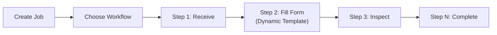

# Sprint 2: Workflow Restructuring

**Goal**: Create Job → Choose Workflow → Run Job (with form step activities)

**Start Date**: 2026-01-07
**Status**: ✅ Complete

---

## Overview

Restructure application to be job-centric with dynamic form templates as workflow steps.

### Key Changes

1. Add form template support to workflow steps
2. Enable dynamic form rendering from template schema
3. Create sample form templates for workflows

---

## Parallel Workstreams

```text
┌─────────────────┐  ┌─────────────────┐  ┌─────────────────┐
│  STREAM A       │  │  STREAM B       │  │  STREAM C       │
│  Backend/DB     │  │  Frontend       │  │  Cleanup        │
└────────┬────────┘  └────────┬────────┘  └────────┬────────┘
         │                    │                    │
    [A1-A4] ✅           [B1-B3] ✅          [C1-C3] ✅
         └────────────────────┴────────────────────┘
                              │
                         [TESTING] 🔄
```

---

## Stream A: Backend & Database ✅

### A1. Database Migration ✅

- [x] Add `required_template_id` FK to `workflow_statuses`
- [x] Add support for dynamic form templates in workflow steps

### A2. Model Updates ✅

- [x] `WorkflowStatus`: add `requiredTemplate()` relationship
- [x] `WorkshopJob`: add `fieldValues()` relationship for form data

### A3. Workflow Executor Enhancement ✅

- [x] Check `required_template_id` on transition
- [x] Validate form before allowing transition
- [x] Store form values in `job_field_values`

### A4. Seeder ✅

- [x] Create sample form templates with fields

---

## Stream B: Frontend ✅

### B1. Workflow Step Form UI ✅

- [x] Component to show form when step requires template
- [x] Dynamic form rendering from template schema
- [x] `DynamicJobForm.vue` component created
- [x] `DynamicFormRenderer.vue` and `DynamicField.vue` components

### B2. Job Creation Flow ✅

- [x] Job creation → workflow selection flow
- [x] `Jobs/Create.vue` includes workflow selector
- [x] Auto-select default workflow on mount

### B3. Transition UI ✅

- [x] Transition button passes form data
- [x] `JobStatusTransition.vue` accepts `formData` prop
- [x] Form data submitted with status transition

---

## Stream C: Cleanup ✅

### C1. Code Cleanup ✅

- [x] Remove deprecated standalone form controllers
- [x] Remove deprecated form models and services
- [x] Clean up unused policies
- [x] Remove deprecated frontend components
- [x] Update routes to use new workflow structure

---

## Stream D: Testing 🔄

### D1. Update Existing Tests

- [ ] Update deprecated controller tests
- [ ] Update workflow tests for new structure
- [ ] Update policy tests

### D2. New Tests

- [ ] Test workflow step with required template
- [ ] Test form submission on transition

---

## Implemented Components

| Component | Location | Status |
|-----------|----------|--------|
| Template Models | `app/Models/Template/` | ✅ |
| Workflow Models | `app/Models/Workflow/` | ✅ |
| Template Controllers | `app/Http/Controllers/Admin/` | ✅ |
| Workflow Controllers | `app/Http/Controllers/Admin/` | ✅ |
| DynamicJobService | `app/Services/Job/` | ✅ |
| DynamicJobForm.vue | `components/workshop/` | ✅ |
| DynamicField.vue | `components/dynamic-form/` | ✅ |
| JobStatusTransition.vue | `components/workshop/` | ✅ |

---

## Architecture Diagram



---

## Related Documents

- [Workflow Option 1](../02-architecture/07-workflow-option-1.md)
- [Workflow Option 2](../02-architecture/08-workflow-option-2.md)
- [Entity Relationship Diagram](../02-architecture/erd.md)

---

**Last Updated**: 2026-01-07
