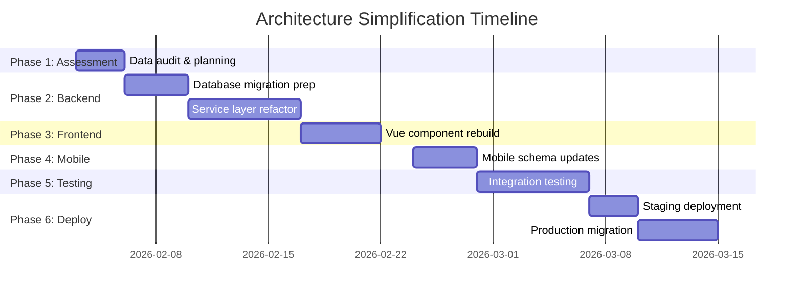

# Sprint 7: Architecture Simplification - Remove Dynamic Workflow System

> **Sprint Goal**: Remove dynamic workflow engine and template system, implement static job modes  
> **Duration**: 6-7 weeks (estimated)  
> **Version**: v3.0.0-simplified  
> **Status**: 🔴 Not Started - Awaiting Approval  

---

## Sprint Overview

This sprint focuses on **simplifying the application architecture** by removing the dynamic workflow engine and template system, replacing them with **static, predefined job modes** (KEW.PA-10 and NORMAL).

### Business Objectives

1. **Reduce Complexity**: Remove 8 database tables and associated runtime configuration
2. **Improve Performance**: Eliminate JSON template parsing and rule engine overhead
3. **Enhance Maintainability**: Replace dynamic logic with hardcoded, testable business rules
4. **Simplify Developer Onboarding**: Remove steep learning curve for workflow configuration
5. **Mobile-First**: Enable simpler offline sync with static form schemas

---

## Sprint Phases



---

## Week 1: Assessment & Data Audit

### Goals
- ✅ Understand current workflow/template usage
- ✅ Plan data migration strategy
- ✅ Get stakeholder approval

### Tasks

#### 1.1 Data Audit (2 days)

```sql
-- Count jobs per workflow
SELECT 
    w.name AS workflow_name,
    COUNT(j.id) AS job_count,
    j.status
FROM workshop_jobs j
LEFT JOIN workflows w ON j.workflow_id = w.id
GROUP BY w.name, j.status;

-- Identify KEW.PA-10 jobs with dynamic forms
SELECT 
    j.id,
    j.job_number,
    ft.name AS template_name,
    JSON_KEYS(jfd.form_data_json) AS filled_fields
FROM workshop_jobs j
INNER JOIN job_form_data jfd ON j.id = jfd.job_id
INNER JOIN form_templates ft ON jfd.template_id = ft.id
WHERE ft.name LIKE '%KEW%';

-- Find active workflow rules
SELECT 
    wr.id,
    w.name,
    wr.rule_type,
    wr.conditions,
    wr.actions
FROM workflow_rules wr
INNER JOIN workflows w ON wr.workflow_id = w.id
WHERE w.is_active = 1;
```

**Deliverables**:
- [ ] Data audit report
- [ ] Migration risk assessment
- [ ] Field mapping document (dynamic → static)

#### 1.2 Architecture Design Review (1 day)

**Review Documents**:
- [ ] [architecture-redesign.md](file:///C:/Users/zuraidiismail/.gemini/antigravity/brain/c2bfc08a-4fde-4d78-84d0-6de5c361a30c/architecture-redesign.md)
- [ ] [erd-simplified.md](file:///c:/Users/zuraidiismail/RnD/workshop/docs/02-architecture/erd-simplified.md)
- [ ] [16-simplified-job-modes.md](file:///c:/Users/zuraidiismail/RnD/workshop/docs/02-architecture/16-simplified-job-modes.md)

**Approval Checklist**:
- [ ] Business stakeholders approve KEW.PA-10 static form
- [ ] Tech team approves architecture changes
- [ ] Data migration strategy approved
- [ ] Timeline approved

---

## Week 2-3: Backend Migration

### Week 2 Goals
- ✅ Prepare database migration scripts
- ✅ Archive old tables safely
- ✅ Add new static columns

### Tasks

#### 2.1 Database Migration (Week 2)

**Step 1: Create Archive Tables**

```php
// database/migrations/2026_02_10_000001_archive_workflow_tables.php
public function up()
{
    // Archive tables for rollback safety
    DB::statement('CREATE TABLE _archive_workflows AS SELECT * FROM workflows');
    DB::statement('CREATE TABLE _archive_workflow_statuses AS SELECT * FROM workflow_statuses');
    DB::statement('CREATE TABLE _archive_workflow_transitions AS SELECT * FROM workflow_transitions');
    DB::statement('CREATE TABLE _archive_workflow_rules AS SELECT * FROM workflow_rules');
    DB::statement('CREATE TABLE _archive_form_templates AS SELECT * FROM form_templates');
    DB::statement('CREATE TABLE _archive_form_template_fields AS SELECT * FROM form_template_fields');
    DB::statement('CREATE TABLE _archive_form_template_sections AS SELECT * FROM form_template_sections');
    DB::statement('CREATE TABLE _archive_job_form_data AS SELECT * FROM job_form_data');
}
```

**Step 2: Add Static KEW Columns**

```php
// database/migrations/2026_02_10_000002_add_static_kew_fields.php
public function up()
{
    Schema::table('workshop_jobs', function (Blueprint $table) {
        // Job mode
        $table->enum('job_mode', ['KEW_PA_10', 'NORMAL'])->after('id');
        
        // KEW.PA-10 static fields (nullable for normal jobs)
        $table->string('kew_vehicle_registration')->nullable();
        $table->string('kew_asset_tag')->nullable();
        $table->string('kew_department_name')->nullable();
        $table->date('kew_inspection_date')->nullable();
        $table->string('kew_inspector_name')->nullable();
        $table->string('kew_inspector_ic', 14)->nullable();
        $table->text('kew_findings')->nullable();
        $table->text('kew_recommendations')->nullable();
        $table->enum('kew_approval_status', ['pending', 'approved', 'rejected'])->nullable();
        $table->foreignUuid('kew_approved_by_id')->nullable()->references('id')->on('users');
        $table->timestamp('kew_approved_at')->nullable();
        $table->text('kew_rejection_reason')->nullable();
        
        // Indexes
        $table->index(['workshop_id', 'job_mode', 'status']);
        $table->index(['kew_approval_status', 'kew_approved_at']);
    });
}
```

**Step 3: Migrate Dynamic Data to Static**

```php
// database/migrations/2026_02_10_000003_migrate_kew_form_data.php
public function up()
{
    $kewJobs = DB::table('workshop_jobs as j')
        ->join('job_form_data as jfd', 'j.id', '=', 'jfd.job_id')
        ->join('form_templates as ft', 'jfd.template_id', '=', 'ft.id')
        ->where('ft.name', 'LIKE', '%KEW%')
        ->select('j.id', 'jfd.form_data_json')
        ->get();
    
    foreach ($kewJobs as $job) {
        $formData = json_decode($job->form_data_json, true);
        
        DB::table('workshop_jobs')
            ->where('id', $job->id)
            ->update([
                'job_mode' => 'KEW_PA_10',
                'kew_vehicle_registration' => $formData['vehicle_registration'] ?? null,
                'kew_asset_tag' => $formData['asset_tag'] ?? null,
                'kew_department_name' => $formData['department_name'] ?? null,
                'kew_inspection_date' => $formData['inspection_date'] ?? null,
                'kew_inspector_name' => $formData['inspector_name'] ?? null,
                'kew_inspector_ic' => $formData['inspector_ic'] ?? null,
                'kew_findings' => $formData['findings'] ?? null,
                'kew_recommendations' => $formData['recommendations'] ?? null,
            ]);
    }
    
    // Set all other jobs to NORMAL mode
    DB::table('workshop_jobs')
        ->whereNull('job_mode')
        ->update(['job_mode' => 'NORMAL']);
}
```

**Step 4: Drop Old Columns & Tables**

```php
// database/migrations/2026_02_10_000004_drop_workflow_columns.php
public function up()
{
    Schema::table('workshop_jobs', function (Blueprint $table) {
        $table->dropForeign(['workflow_id']);
        $table->dropForeign(['current_workflow_status_id']);
        $table->dropForeign(['template_id']);
        
        $table->dropColumn(['workflow_id', 'current_workflow_status_id', 'template_id']);
    });
    
    // Drop old tables
    Schema::dropIfExists('workflow_rules');
    Schema::dropIfExists('workflow_transitions');
    Schema::dropIfExists('workflow_statuses');
    Schema::dropIfExists('workflows');
    Schema::dropIfExists('job_form_data');
    Schema::dropIfExists('form_template_sections');
    Schema::dropIfExists('form_template_fields');
    Schema::dropIfExists('form_templates');
}
```

**Deliverables**:
- [ ] 4 migration files created
- [ ] Tested on local environment
- [ ] Rollback scripts prepared

#### 2.2 Service Layer Refactor (Week 3)

**Create Static Services**

```php
// app/Services/JobStatusService.php
class JobStatusService
{
    public function transitionStatus(Job $job, JobStatus $newStatus): void
    {
        // Validate based on job mode
        if ($job->job_mode === JobMode::KEW_PA_10) {
            $this->validateKewTransition($job, $newStatus);
        } else {
            $this->validateNormalTransition($job, $newStatus);
        }
        
        $oldStatus = $job->status;
        $job->update(['status' => $newStatus->value]);
        
        $this->executeTransitionSideEffects($job, $oldStatus, $newStatus);
        
        event(new JobStatusChanged($job, $oldStatus, $newStatus));
    }
    
    private function validateKewTransition(Job $job, JobStatus $newStatus): void
    {
        $allowedTransitions = [
            'draft' => ['kew_inspection'],
            'kew_inspection' => ['kew_approval_pending'],
            'kew_approval_pending' => ['kew_approved', 'kew_rejected'],
            'kew_rejected' => ['kew_inspection'],
            'kew_approved' => ['in_progress'],
            'in_progress' => ['completed'],
        ];
        
        $current = $job->status->value;
        if (!in_array($newStatus->value, $allowedTransitions[$current] ?? [])) {
            throw new InvalidStatusTransitionException(
                "Cannot transition from {$current} to {$newStatus->value}"
            );
        }
    }
}
```

```php
// app/Services/KewPa10ValidationService.php
class KewPa10ValidationService
{
    public function validate(Job $job): array
    {
        $errors = [];
        
        $requiredFields = [
            'kew_vehicle_registration',
            'kew_asset_tag',
            'kew_department_name',
            'kew_inspection_date',
            'kew_inspector_name',
            'kew_inspector_ic',
            'kew_findings',
            'kew_recommendations',
        ];
        
        foreach ($requiredFields as $field) {
            if (empty($job->$field)) {
                $errors[$field] = ucwords(str_replace('kew_', '', $field)) . ' is required';
            }
        }
        
        return $errors;
    }
    
    public function canSubmitForApproval(Job $job): bool
    {
        return empty($this->validate($job));
    }
}
```

**Remove Old Services**

- [ ] Delete `app/Services/WorkflowEngine.php`
- [ ] Delete `app/Services/FormTemplateService.php`
- [ ] Delete `app/Services/WorkflowRuleEngine.php`

**Deliverables**:
- [ ] `JobStatusService` created
- [ ] `KewPa10ValidationService` created
- [ ] Old workflow services removed
- [ ] Unit tests written (80%+ coverage)

---

## Week 4: Frontend Rebuild

### Goals
- ✅ Create static Vue components for job forms
- ✅ Remove dynamic template rendering

### Tasks

#### 4.1 Create Static Forms

**KEW.PA-10 Form Component**

```vue
<!-- resources/js/Pages/Jobs/CreateKewPa10.vue -->
<script setup lang="ts">
import { useForm } from '@inertiajs/vue3';

const form = useForm({
  job_mode: 'KEW_PA_10',
  title: '',
  description: '',
  kew_vehicle_registration: '',
  kew_asset_tag: '',
  kew_department_name: '',
  kew_inspection_date: '',
  kew_inspector_name: '',
  kew_inspector_ic: '',
  kew_findings: '',
  kew_recommendations: '',
});

function submit() {
  form.post(route('jobs.store'));
}
</script>

<template>
  <form @submit.prevent="submit">
    <h2>KEW.PA-10 Government Inspection</h2>
    
    <!-- Vehicle Section -->
    <fieldset>
      <legend>Vehicle/Asset Information</legend>
      
      <div class="form-group">
        <label for="vehicle-reg">Vehicle Registration *</label>
        <input 
          id="vehicle-reg"
          v-model="form.kew_vehicle_registration" 
          required 
          placeholder="e.g., WA1234A"
        />
        <span v-if="form.errors.kew_vehicle_registration" class="error">
          {{ form.errors.kew_vehicle_registration }}
        </span>
      </div>
      
      <!-- More fields... -->
    </fieldset>
    
    <!-- Inspection Section -->
    <fieldset>
      <legend>Inspection Details</legend>
      <!-- Fields... -->
    </fieldset>
    
    <button type="submit" :disabled="form.processing">
      Create KEW.PA-10 Job
    </button>
  </form>
</template>
```

**Normal Job Form**

```vue
<!-- resources/js/Pages/Jobs/CreateNormal.vue -->
<script setup lang="ts">
import { useForm } from '@inertiajs/vue3';

const form = useForm({
  job_mode: 'NORMAL',
  customer_id: '',
  title: '',
  description: '',
  priority: 'medium',
  estimated_cost: null,
});
</script>

<template>
  <form @submit.prevent="form.post(route('jobs.store'))">
    <h2>Create Workshop Job</h2>
    
    <div class="form-group">
      <label>Customer *</label>
      <select v-model="form.customer_id" required>
        <option value="">Select customer</option>
        <!-- Options from props -->
      </select>
    </div>
    
    <div class="form-group">
      <label>Job Title *</label>
      <input v-model="form.title" required />
    </div>
    
    <!-- More fields... -->
    
    <button type="submit">Create Job</button>
  </form>
</template>
```

**Job Mode Selection**

```vue
<!-- resources/js/Pages/Jobs/SelectMode.vue -->
<template>
  <div class="job-mode-selector">
    <h2>Select Job Type</h2>
    
    <div class="mode-cards">
      <Link :href="route('jobs.create.kew')" class="mode-card">
        <h3>🏛️ KEW.PA-10</h3>
        <p>Government vehicle inspection</p>
      </Link>
      
      <Link :href="route('jobs.create.normal')" class="mode-card">
        <h3>🔧 Normal Job</h3>
        <p>Standard repair/service</p>
      </Link>
    </div>
  </div>
</template>
```

**Remove Old Components**

- [ ] Delete `resources/js/Components/DynamicFormRenderer.vue`
- [ ] Delete `resources/js/Components/WorkflowStatusBadge.vue`
- [ ] Delete `resources/js/Components/TemplateFieldRenderer.vue`

**Deliverables**:
- [ ] 3 new Vue components created
- [ ] Old dynamic components removed
- [ ] Routes updated
- [ ] Manual UI testing complete

---

## Week 5: Mobile App Updates

### Goals
- ✅ Update mobile app with static form schemas
- ✅ Simplify offline sync logic

### Tasks

#### 5.1 Static Form Schemas

```typescript
// mobile/src/schemas/JobSchemas.ts
export const KEW_PA_10_SCHEMA = {
  fields: [
    { name: 'kew_vehicle_registration', type: 'text', required: true, label: 'Vehicle Registration' },
    { name: 'kew_asset_tag', type: 'text', required: true, label: 'Asset Tag' },
    { name: 'kew_department_name', type: 'text', required: true, label: 'Department' },
    { name: 'kew_inspection_date', type: 'date', required: true, label: 'Inspection Date' },
    { name: 'kew_inspector_name', type: 'text', required: true, label: 'Inspector Name' },
    { name: 'kew_inspector_ic', type: 'text', required: true, label: 'Inspector IC', maxLength: 14 },
    { name: 'kew_findings', type: 'textarea', required: true, label: 'Findings', rows: 5 },
    { name: 'kew_recommendations', type: 'textarea', required: true, label: 'Recommendations', rows: 5 },
  ],
  
  validate(data: any): string[] {
    const errors: string[] = [];
    this.fields.forEach(field => {
      if (field.required && !data[field.name]) {
        errors.push(`${field.label} is required`);
      }
    });
    return errors;
  }
};
```

**Deliverables**:
- [ ] Static schemas defined
- [ ] Mobile forms rebuilt
- [ ] Offline sync updated
- [ ] Mobile testing complete (iOS + Android)

---

## Week 6-7: Testing & Deployment

### Week 6: Integration Testing

**Test Scenarios**

| Scenario | KEW.PA-10 | Normal | Expected Result |
|----------|-----------|--------|-----------------|
| Create job | ✅ | ✅ | Success |
| Validate required fields | ✅ | ✅ | Show errors |
| Status transition (valid) | ✅ | ✅ | Success |
| Status transition (invalid) | ❌ | ❌ | Block with error |
| Submit for approval | ✅ | N/A | Update status |
| Approve KEW job | ✅ | N/A | Set approved |
| Reject KEW job | ✅ | N/A | Set rejected |
| Mobile offline create | ✅ | ✅ | Sync when online |

**Deliverables**:
- [ ] 50+ integration test cases written
- [ ] All tests passing
- [ ] Performance benchmarks met

### Week 7: Deployment

**Staging Deployment (Days 1-3)**

```bash
# 1. Backup production data
php artisan backup:run --only-db

# 2. Deploy to staging
git checkout release/v3.0.0-simplified
composer install --no-dev
npm run build
php artisan migrate --force

# 3. Verify
php artisan test
php artisan queue:work --once
```

**Production Migration (Days 4-7)**

1. **Pre-deployment checklist**
   - [ ] All tests passing
   - [ ] Database backup verified
   - [ ] Rollback scripts tested
   - [ ] Stakeholder sign-off

2. **Migration window** (off-peak hours)
   - [ ] Enable maintenance mode
   - [ ] Run migrations
   - [ ] Verify data integrity
   - [ ] Smoke tests
   - [ ] Disable maintenance mode

3. **Post-deployment monitoring**
   - [ ] Monitor error logs (24h)
   - [ ] Track user feedback
   - [ ] Performance metrics

**Deliverables**:
- [ ] Staging deployment successful
- [ ] Production deployment successful
- [ ] Zero data loss
- [ ] Post-deployment report

---

## Success Criteria

### Performance Targets

| Metric | Before | After | Target |
|--------|--------|-------|--------|
| Job creation time | 800ms | TBD | <400ms |
| Status transition | 300ms | TBD | <150ms |
| Database tables | 26 | 18 | -8 |
| Code complexity | High | TBD | Medium |
| Developer onboarding | 2 weeks | TBD | 3 days |

### Business Outcomes

- [ ] All existing KEW.PA-10 jobs migrated successfully
- [ ] All normal jobs working as expected
- [ ] No customer complaints
- [ ] Mobile app sync working smoothly
- [ ] Documentation updated

---

## Risk Mitigation

| Risk | Impact | Mitigation |
|------|--------|------------|
| Data loss during migration | 🔴 Critical | Full backup + archive tables + dry run |
| Breaking changes for existing jobs | 🟡 Medium | Comprehensive testing + gradual rollout |
| Mobile app offline sync issues | 🟡 Medium | Extensive offline testing + monitoring |
| User confusion with new forms | 🟢 Low | User training + in-app help text |

---

## Rollback Plan

If critical issues arise:

```bash
# 1. Restore archive tables
php artisan migrate:rollback

# 2. Restore from backup
mysql workshop_db < backup_2026_02_10.sql

# 3. Redeploy previous version
git checkout v2.9.0
composer install
php artisan migrate
```

---

## Documentation Updates

**Files to Create**:
- [x] `07-sprint-architecture-simplification.md` (this file)
- [ ] `05-migration-guide.md` - Step-by-step migration instructions
- [ ] `06-testing-guide.md` - Testing checklist

**Files to Update**:
- [ ] `erd.md` - Replace with simplified version
- [ ] `16-simplified-job-modes.md` - Add usage examples
- [ ] `01-developer-onboarding.md` - Update architecture section

---

## Team Assignments

| Role | Responsibilities |
|------|------------------|
| **Backend Lead** | Database migration, service layer refactor |
| **Frontend Lead** | Vue components, form validation |
| **Mobile Lead** | Mobile app updates, offline sync |
| **QA Lead** | Test plan creation, integration testing |
| **DevOps** | Deployment automation, monitoring |
| **Product Owner** | Stakeholder communication, acceptance criteria |

---

## Sprint Retrospective (Post-Sprint)

**What went well**:
- TBD

**What didn't go well**:
- TBD

**Action items**:
- TBD

---

**Sprint Status**: 🔴 Not Started  
**Approval Needed**: YES - Awaiting stakeholder sign-off  
**Next Review**: TBD
