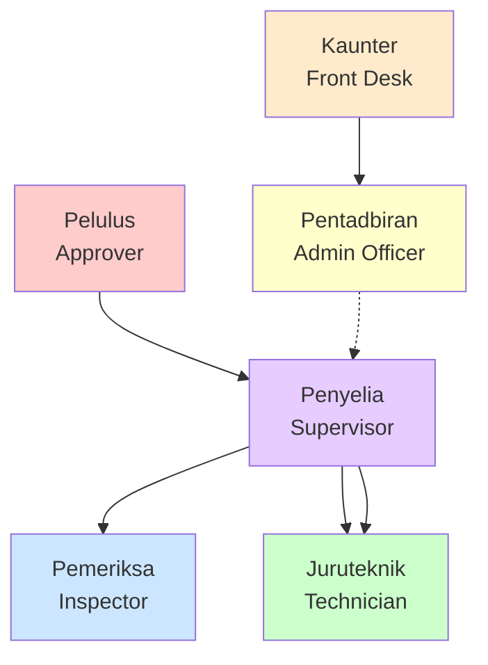

# User Roles and Permissions

## Overview

The Government Workshop Management System (KEW.PA-10) implements a five-tier role-based access control system aligned with Malaysian government workshop operations.

## Role Hierarchy

## Role Definitions

### 🟡 Pentadbiran (Admin Officer)

**English**: Admin Officer
**Bahasa Malaysia**: Pentadbiran

**Primary Responsibility**: System administration, KEW.PA-10 management, and job record creation

**Permissions Matrix**:

| Feature | View | Create | Edit | Delete | Approve |
|---------|------|--------|------|--------|---------|
| KEW.PA-10 Forms | ✅ All | ✅ | ✅ | ❌ | ❌ |
| Job Records | ✅ All | ✅ | ✅ | ❌ | ❌ |
| Inspections | ✅ All | ❌ | ❌ | ❌ | ❌ |
| Work Orders | ✅ All | ❌ | ❌ | ❌ | ❌ |
| Users | ✅ All | ✅ | ✅ | ✅ | ❌ |
| Reports | ✅ All | ✅ | ❌ | ❌ | ❌ |
| Assets | ✅ All | ✅ | ✅ | ❌ | ❌ |
| Parts Inventory | ✅ All | ✅ | ✅ | ❌ | ❌ |

**Key Actions**:

- Receive external KEW.PA-10 forms
- Register forms in system
- Generate internal KEW.PA-10 forms
- Create job records
- Submit jobs for approval
- Generate system reports
- Manage user accounts
- Configure system settings

**Workflows Involved**:

- Option 1: KEW.PA-10 reception and registration
- Option 2: KEW.PA-10 generation from inspections

**Typical Daily Tasks**:

1. Check for incoming KEW.PA-10 forms
2. Register new jobs in system
3. Follow up on pending approvals
4. Generate daily/weekly reports
5. Update asset and inventory records

---

### 🟣 Penyelia (Supervisor)

**English**: Supervisor
**Bahasa Malaysia**: Penyelia

**Primary Responsibility**: Job assignment, quality control, and work review

**Permissions Matrix**:

| Feature | View | Create | Edit | Delete | Approve |
|---------|------|--------|------|--------|---------|
| KEW.PA-10 Forms | ✅ All | ❌ | ✅ Status | ❌ | ❌ |
| Job Records | ✅ All | ✅ | ✅ | ❌ | ❌ |
| Inspections | ✅ All | ❌ | ❌ | ❌ | ✅ |
| Work Orders | ✅ All | ✅ | ✅ | ❌ | ❌ |
| Technician Assignment | ✅ | ✅ | ✅ | ✅ | ❌ |
| Work Completion | ✅ All | ❌ | ❌ | ❌ | ✅ |
| Users | ✅ Team | ❌ | ❌ | ❌ | ❌ |
| Reports | ✅ Team | ✅ | ❌ | ❌ | ❌ |

**Key Actions**:

- Review job requests
- Assign jobs to technicians
- Validate repair requirements
- Approve inspection reports
- Review completed work
- Conduct quality inspections
- Update KEW.PA-10 status
- Close work orders
- Monitor team performance

**Workflows Involved**:

- Option 1: Job assignment and completion review
- Option 2: Inspection approval and work review

**Typical Daily Tasks**:

1. Review new inspection reports
2. Assign pending jobs to available technicians
3. Monitor ongoing work progress
4. Review completed work submissions
5. Close completed work orders
6. Update KEW.PA-10 forms
7. Generate team performance reports

---

### 🔵 Pemeriksa (Inspector)

**English**: Inspector
**Bahasa Malaysia**: Pemeriksa

**Primary Responsibility**: Asset inspections, condition validation, and compliance checks

**Permissions Matrix**:

| Feature | View | Create | Edit | Delete | Approve |
|---------|------|--------|------|--------|---------|
| KEW.PA-10 Forms | ✅ Own | ❌ | ❌ | ❌ | ❌ |
| Job Records | ✅ Own | ❌ | ❌ | ❌ | ❌ |
| Inspections | ✅ Own | ✅ | ✅ Own | ❌ | ❌ |
| Assets | ✅ All | ❌ | ❌ | ❌ | ✅ Condition |
| Photos | ✅ Own | ✅ | ✅ Own | ✅ Own | ❌ |
| Inspection Reports | ✅ Own | ✅ | ✅ Own | ❌ | ❌ |
| Users | ✅ Self | ❌ | ❌ | ❌ | ❌ |
| Reports | ✅ Own | ✅ | ❌ | ❌ | ❌ |

**Key Actions**:

- Schedule asset inspections
- Conduct physical inspections
- Document asset conditions
- Take inspection photos
- Identify repair needs
- Validate KEW.PA-10 details (Option 1)
- Submit inspection reports
- Recommend repair priorities

**Workflows Involved**:

- Option 1: Asset and KEW.PA-10 validation
- Option 2: Inspection initiation and reporting

**Typical Daily Tasks**:

1. Review inspection schedule
2. Conduct scheduled inspections
3. Upload inspection photos
4. Complete inspection checklists
5. Submit inspection reports
6. Follow up on pending validations
7. Update asset condition records

**Mobile Features**:

- Offline inspection forms
- Camera integration for photos
- GPS location capture
- Barcode scanning for asset IDs
- Sync when online

---

### 🟠 Kaunter (Front Desk)

**English**: Front Desk
**Bahasa Malaysia**: Kaunter

**Primary Responsibility**: Job initiation, walk-in customer management, and reception

**Permissions Matrix**:

| Feature | View | Create | Edit | Delete | Approve |
|---------|------|--------|------|--------|---------|
| KEW.PA-10 Forms | ✅ All | ✅ | ✅ | ❌ | ❌ |
| Job Records | ✅ All | ✅ | ✅ | ❌ | ❌ |
| Inspections | ❌ | ❌ | ❌ | ❌ | ❌ |
| Users | ✅ Team | ❌ | ❌ | ❌ | ❌ |
| Reports | ❌ | ❌ | ❌ | ❌ | ❌ |

**Key Actions**:

- Greet customers
- Register walk-in requests
- Create new job records (Normal & KEW.PA-10)
- Verify received documents
- Direct inquiries

**Workflows Involved**:

- Option 1: Initial reception and job creation
- Option 2: Job creation

**Typical Daily Tasks**:

1. Manage reception desk
2. Create jobs for walk-in customers
3. Receive KEW.PA-10 forms
4. Update basic job details

---

### 🔴 Pelulus (Approver)

**English**: Approver
**Bahasa Malaysia**: Pelulus

**Primary Responsibility**: Work order approval and budget authorization

**Permissions Matrix**:

| Feature | View | Create | Edit | Delete | Approve |
|---------|------|--------|------|--------|---------|
| KEW.PA-10 Forms | ✅ All | ❌ | ❌ | ❌ | ✅ |
| Job Records | ✅ All | ❌ | ❌ | ❌ | ✅ |
| Inspections | ✅ All | ❌ | ❌ | ❌ | ❌ |
| Work Orders | ✅ All | ❌ | ❌ | ❌ | ✅ |
| Budget | ✅ All | ❌ | ❌ | ❌ | ✅ |
| Approvals | ✅ All | ✅ | ❌ | ❌ | ✅ |
| Users | ✅ All | ❌ | ❌ | ❌ | ❌ |
| Reports | ✅ All | ✅ | ❌ | ❌ | ❌ |

**Key Actions**:

- Review work orders
- Check budget allocations
- Validate cost estimates
- Approve or reject repairs
- Apply digital signatures
- Monitor budget utilization
- Review department budgets
- Escalate over-budget requests

**Workflows Involved**:

- Option 2: Work order approval (primary role)

**Approval Thresholds**:

| Amount (RM) | Approval Required |
|-------------|-------------------|
| < 1,000 | Supervisor only |
| 1,000 - 5,000 | Single Approver |
| 5,000 - 20,000 | Two Approvers |
| > 20,000 | Dept Head + Finance |

**Typical Daily Tasks**:

1. Review pending approval queue
2. Check budget availability
3. Review inspection findings
4. Approve/reject work orders
5. Apply digital signatures
6. Monitor budget utilization
7. Generate approval reports

**Digital Signature**:

- MyKad integration
- Government certificate authority
- Cryptographic validation
- Non-repudiation audit trail

---

### 🟢 Juruteknik (Technician)

**English**: Technician
**Bahasa Malaysia**: Juruteknik

**Primary Responsibility**: Repair execution and work documentation

**Permissions Matrix**:

| Feature | View | Create | Edit | Delete | Approve |
|---------|------|--------|------|--------|---------|
| KEW.PA-10 Forms | ✅ Assigned | ❌ | ❌ | ❌ | ❌ |
| Job Records | ✅ Assigned | ❌ | ❌ | ❌ | ❌ |
| Work Orders | ✅ Assigned | ❌ | ✅ Status | ❌ | ❌ |
| Work Progress | ✅ Own | ✅ | ✅ Own | ❌ | ❌ |
| Photos | ✅ Own | ✅ | ✅ Own | ✅ Own | ❌ |
| Parts Usage | ✅ Own | ✅ | ✅ Own | ❌ | ❌ |
| Time Logs | ✅ Own | ✅ | ✅ Own | ❌ | ❌ |
| Users | ✅ Self | ❌ | ❌ | ❌ | ❌ |
| Reports | ✅ Own | ❌ | ❌ | ❌ | ❌ |

**Key Actions**:

- Receive work order assignments
- Review job details and requirements
- Take before photos
- Perform repair work
- Document work progress
- Record parts usage
- Take during and after photos
- Update work status
- Complete work reports
- Submit for supervisor review

**Workflows Involved**:

- Option 1: Repair execution
- Option 2: Repair execution

**Typical Daily Tasks**:

1. Check assigned work orders
2. Review job requirements
3. Gather tools and parts
4. Take before photos
5. Perform repairs
6. Document progress
7. Take after photos
8. Update parts usage
9. Submit completion reports

**Photo Requirements**:

- Before: 3+ photos
- During: 3+ photos of critical steps
- After: 5+ photos from multiple angles
- Max 10MB per photo
- Auto-timestamp and GPS

---

## Permission Levels Explained

### View Permissions

- **All**: Can view all records in the system
- **Team**: Can view records for their team/department
- **Own**: Can only view records they created or assigned to them
- **Assigned**: Can only view records assigned to them
- **Self**: Can only view their own profile

### Action Permissions

- **✅ Full**: Complete access to create, edit, or delete
- **✅ Limited**: Can perform action with restrictions (e.g., only own records)
- **✅ Status**: Can only update status/workflow fields
- **❌ No Access**: Cannot perform this action

### Approval Permissions

- **✅ Approve**: Can approve/reject items
- **✅ Condition**: Can approve with conditions
- **❌ No Approval**: Cannot approve items

## Role Assignment

### How Users Get Roles

1. **New User Registration**
   - Submitted by department
   - Verified by Admin Officer
   - Role assigned based on position
   - Account activated

2. **Role Change Request**
   - User submits request
   - Department head approves
   - Admin Officer updates system
   - User notified of change

3. **Temporary Role Assignment**
   - For leave coverage
   - Limited duration
   - Original role retained
   - Auto-reverts after period

## Multi-Role Users

Some users may have multiple roles:

**Example**: User can be both Inspector and Technician

**Access Rules**:

- User can switch between roles
- Permissions combined (most permissive wins)
- Activities logged per role
- Reporting shows role context

**Role Switching**:

1. Click role selector in header
2. Select active role
3. Interface updates for that role
4. Permission set changes accordingly

## Audit and Compliance

### Activity Logging

All role-based actions are logged:

- User ID and name
- Role at time of action
- Timestamp
- Action performed
- IP address
- Data changed

### Compliance Reports

Available reports by role:

- User activity by role
- Permission usage tracking
- Unauthorized access attempts
- Role change history
- Digital signature audit trail

## Related Documents

- [Workflow Option 1](../02-architecture/07-workflow-option-1.md) - External KEW.PA-10 workflow
- [Workflow Option 2](../02-architecture/08-workflow-option-2.md) - Internal inspection workflow
- [Security Architecture](../02-architecture/05-security-architecture.md) - Role-based access control
- [Admin Officer Guide](02-admin-officer-guide.md) - Detailed admin guide
- [Supervisor Guide](03-supervisor-guide.md) - Detailed supervisor guide
- [Inspector Guide](04-inspector-guide.md) - Detailed inspector guide
- [Approver Guide](05-approver-guide.md) - Detailed approver guide
- [Technician Guide](06-technician-guide.md) - Detailed technician guide

---

**Last Updated**: 2025-12-28
**Version**: 1.0
**Status**: Active
