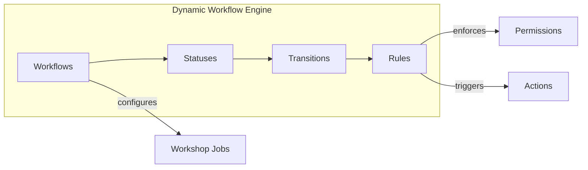
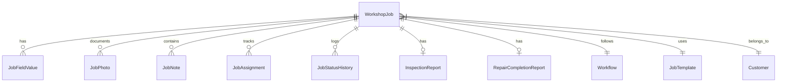
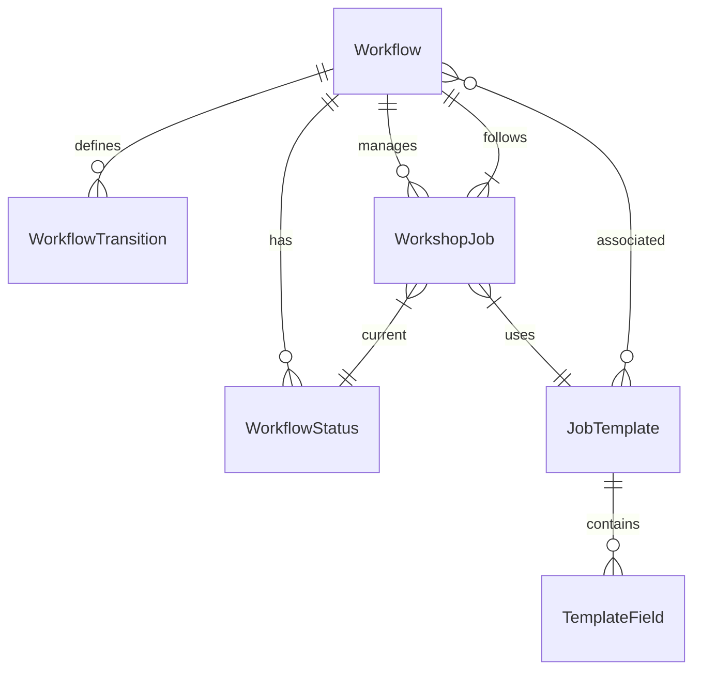

# Workshop Management System - Architecture & Capability Overview

> **Version**: 2.0  
> **Last Updated**: 2026-02-02  
> **Audience**: Solution Architects, Technical Leads, Development Teams  
> **Purpose**: Comprehensive system architecture and multi-tenant capabilities guide

---

## Executive Summary

The **Government Workshop Management System (KEW.PA-10)** is a production-ready, enterprise-grade application designed for Malaysian government asset maintenance operations. Built on a modern Laravel 12 + Vue.js 3 + Inertia.js stack, the system features a **dynamic workflow engine** that enables configuration-driven customization without code changes.

### Core Value Propositions

| Capability | Business Impact |
|------------|-----------------|
| **G-Compliance Engine** | Automates KEW.PA-10 government forms, preventing claim rejections |
| **Dynamic Workflow System** | No-code workflow customization for different operational needs |
| **Multi-Tier Role Security** | 5-role separation of duties preventing fraud and ensuring accountability |
| **Evidence Management** | Before/During/After photo documentation for audit compliance |
| **Digital Signatures** | Cryptographic-grade signatures for legal accountability |

---

## System Architecture

### Technology Stack

```
┌─────────────────────────────────────────────────────────────────┐
│                        PRESENTATION LAYER                        │
├──────────────────────────────┬──────────────────────────────────┤
│          WEB APP             │         MOBILE APP               │
├──────────────────────────────┼──────────────────────────────────┤
│  Vue.js 3 (Composition API)  │  React Native + Expo             │
│  Inertia.js (SPA Bridge)     │  React Navigation 6              │
│  TailwindCSS                 │  NativeWind (Tailwind Mobile)    │
│  Pinia State                 │  Zustand State                   │
│  Chart.js                    │  TanStack Query (Cache)          │
│  Dynamic Forms               │  Expo Camera/Location            │
├──────────────────────────────┴──────────────────────────────────┤
│                        APPLICATION LAYER                         │
├─────────────────────────────────────────────────────────────────┤
│  Laravel 12        │  Spatie Permissions  │  Sanctum Auth       │
│  Service Layer     │  Repository Pattern  │  Event System       │
│  RESTful API       │  Push Notifications  │  Mobile Endpoints   │
├─────────────────────────────────────────────────────────────────┤
│                          DATA LAYER                              │
├─────────────────────────────────────────────────────────────────┤
│  MySQL 8.0+ / PostgreSQL 14+  │  Redis Cache/Queue  │  Eloquent │
│  Expo SQLite (Mobile Offline) │  Firebase (Push)    │  S3/Local │
└─────────────────────────────────────────────────────────────────┘
```

### Design Patterns

| Pattern | Implementation |
|---------|---------------|
| **Service Layer** | Business logic in `app/Services/` (JobService, WorkflowService, etc.) |
| **Repository** | Eloquent models with relationships in `app/Models/` |
| **Strategy** | Field type rendering via component mapping |
| **Observer** | Workflow rule engine for status change automation |
| **Factory** | Dynamic form schema generation |

---

## Core Modules & Capabilities

### 1. Dynamic Workflow Engine

The heart of the system's scalability. Administrators can create unlimited workflows without code changes.



**Key Features:**
- **Database-driven statuses**: Create custom status flows (e.g., Pending → Inspection → Repair → Complete)
- **Transition rules**: Define who can move jobs between statuses (role-based)
- **Conditional logic**: JSON-based conditions for auto-routing
- **Action triggers**: Automated notifications, assignments, field requirements

**Database Tables:**
- `workflows` - Workflow definitions
- `workflow_statuses` - Status steps within workflows
- `workflow_transitions` - Allowed status changes with permissions
- `workflow_rules` - Business rules per status

---

### 2. Dynamic Form Templates

Fully configurable forms without code modifications.

**Supported Field Types (12 types):**

| Type | Description | Use Case |
|------|-------------|----------|
| `text` | Single-line input | Job title, reference numbers |
| `number` | Numeric with min/max | Cost estimates, quantities |
| `textarea` | Multi-line text | Descriptions, notes |
| `date` | Date picker | Due dates, inspection dates |
| `datetime` | Date + time | Appointments, completions |
| `dropdown` | Single select | Status, priority |
| `radio` | Radio buttons | Yes/No options |
| `checkbox` | Boolean | Approval flags |
| `multiselect` | Multiple selection | Categories, tags |
| `file` | File upload | Documents |
| `image` | Image with preview | Photo evidence |
| `calculated` | Formula-based | Auto-computed costs |

**Template Features:**
- Section grouping with display ordering
- Grid column span for layout control
- Conditional visibility rules
- Dynamic validation rules
- Options from static lists or database queries

---

### 3. Job Management

Central entity managing all workshop operations.



**Key Job Features:**
- Template-based job creation
- Dynamic field value storage
- Multi-stage photo documentation
- Assignment history tracking
- Complete audit trail

---

### 4. Role-Based Access Control (RBAC)

Five-tier government role structure powered by Spatie Laravel-Permission.

| Role | Malay Name | Responsibilities |
|------|------------|------------------|
| 🟡 **Admin Officer** | Pentadbiran | Reception, documentation, system administration |
| 🟣 **Supervisor** | Penyelia | Job assignment, work review, quality control |
| 🔵 **Inspector** | Pemeriksa | Asset inspections, condition validation |
| 🔴 **Approver** | Pelulus | Work order approval, budget authorization |
| 🟢 **Technician** | Juruteknik | Repair execution, photo documentation |

**Permission System:**
- Role-to-permission mapping
- Workflow transition restrictions
- Field-level visibility control
- Action-based authorization

---

### 5. KEW.PA-10 Compliance

Malaysian government form automation.

**Two Workflow Options:**

**Option 1: External Reception**
```
Gov Dept submits KEW.PA-10 → Admin receives → Supervisor assigns → 
Inspector validates → Technician repairs → Supervisor reviews → Complete
```

**Option 2: Internal Inspection**
```
Inspector conducts inspection → Supervisor reviews findings → 
Admin generates KEW.PA-10 → Approver approves → Technician repairs → Complete
```

---

### 6. Evidence Management

Multi-stage photo documentation system.

**Photo Stages:**
1. **Initial** - Asset condition at reception
2. **Diagnostic** - During inspection
3. **In-Progress** - During repair work
4. **After Repair** - Completed work

**Features:**
- Minimum photo enforcement per stage
- Timestamp and location metadata
- Public/private visibility
- Integration with inspection/completion reports

---

### 7. Reporting & Analytics

**Available Reports:**
- Job status dashboards
- Technician productivity metrics
- Cost analysis and budget tracking
- Asset maintenance history
- Workflow performance analysis

**Export Formats:**
- PDF (invoices, completion reports)
- Excel (data exports)
- API (external integrations)

---

### 8. Mobile Application (React Native + Expo)

Native mobile apps for field workers to perform duties without desktop access.

**Target Users:**
- 🟢 **Technicians** - Primary (photo evidence, job completion)
- 🔵 **Inspectors** - Primary (inspection reports, asset validation)
- 🟣 **Supervisors** - Secondary (job review, approval)

**Key Mobile Features:**

| Feature | Description |
|---------|-------------|
| **Offline Mode** | Full job management without internet connectivity |
| **Photo Evidence** | Camera integration with GPS tagging and timestamps |
| **Push Notifications** | Job assignments, status updates, due date reminders |
| **Biometric Auth** | Face ID / Touch ID for secure login |
| **Dynamic Forms** | Same form system as web (inspection/completion reports) |
| **Auto Sync** | Background synchronization when connectivity available |
| **QR Scanner** | Quick asset identification and job lookup |

**Platform Support:**
- iOS 14+ (iPhone 8 and newer)
- Android 8.0+ (API 26+, 2GB+ RAM)

**Technical Architecture:**
```
React Native + Expo
├─ React Navigation 6 (Routing)
├─ Zustand (State Management)
├─ TanStack Query (API Caching)
├─ Expo SQLite (Offline Storage)
├─ Expo Camera (Photo Capture)
├─ Expo SecureStore (Token Storage)
└─ Firebase Cloud Messaging (Push)
```

**Development Timeline:** 12 weeks (3 months MVP)

**See:** [Mobile Application PRD](02-architecture/11-mobile-prd.md) for complete requirements

---

## Database Architecture

### Entity Summary (20+ Tables)

| Domain | Tables |
|--------|--------|
| **Core** | `users`, `customers`, `government_departments`, `assets`, `workshop_jobs` |
| **Workflow** | `workflows`, `workflow_statuses`, `workflow_transitions`, `workflow_rules` |
| **Templates** | `job_templates`, `template_fields`, `template_field_types`, `template_workflows` |
| **Job Data** | `job_field_values`, `job_notes`, `job_photos`, `job_assignments`, `job_status_histories` |
| **Reporting** | `inspection_reports`, `repair_completion_reports` |

### Key Relationships



---

## Scalability Considerations

### Multi-Tenancy Options

| Approach | Description | Use Case |
|----------|-------------|----------|
| **Single Database** | All tenants share tables with `tenant_id` | Small-medium scale |
| **Schema Separation** | Separate PostgreSQL schemas per tenant | Medium-large scale |
| **Database per Tenant** | Completely isolated databases | Enterprise/government |

### Horizontal Scaling

```
                    ┌─────────────────┐
                    │  Load Balancer  │
                    └────────┬────────┘
           ┌─────────────────┼─────────────────┐
           ▼                 ▼                 ▼
    ┌─────────────┐   ┌─────────────┐   ┌─────────────┐
    │   App Node  │   │   App Node  │   │   App Node  │
    │   Laravel   │   │   Laravel   │   │   Laravel   │
    └──────┬──────┘   └──────┬──────┘   └──────┬──────┘
           │                 │                 │
           └─────────────────┼─────────────────┘
                    ┌────────▼────────┐
                    │  Redis Cluster  │ (Session/Cache/Queue)
                    └────────┬────────┘
                    ┌────────▼────────┐
                    │ MySQL/PostgreSQL│ (Primary + Replicas)
                    └─────────────────┘
```

### Performance Optimizations

- **Redis** for session, cache, and queue
- **Database indexing** on frequently queried columns
- **Lazy loading prevention** with Eloquent eager loading
- **API rate limiting** via Laravel middleware
- **Asset bundling** via Vite for frontend

---

## Extension Points

### Custom Workflow Creation

1. Create new workflow via Admin UI or migration
2. Define statuses with ordering
3. Configure transitions with role permissions
4. Associate with job templates
5. Add workflow rules (optional)

### Custom Field Types

1. Add entry to `template_field_types` table
2. Create Vue component in `resources/js/components/dynamic-form/fields/`
3. Register component in field type mapper

### API Integration

- RESTful endpoints for external system integration
- Laravel Sanctum for API authentication
- Webhook support for event-driven integrations

---

## Deployment Options

### On-Premise

- Traditional server with PHP 8.2+, MySQL/PostgreSQL
- Full data sovereignty for government compliance
- Recommended for sensitive government data

### Cloud (AWS/Azure/GCP)

- Container-based deployment (Docker/Kubernetes)
- Managed databases (RDS, Cloud SQL)
- Auto-scaling capabilities

### Hybrid

- Application on-premise with cloud backup
- Best of both worlds for compliance + scalability

### Mobile Distribution

**iOS:**
- App Store (public release)
- TestFlight (beta testing)
- **Enterprise Distribution** (government-only, recommended)

**Android:**
- Google Play Store (public release)
- Internal Testing Track (beta)
- **Private Enterprise Distribution** (government-only, recommended)

---

## Security Architecture

### Authentication

- Laravel Sanctum for SPA + API authentication
- Two-factor authentication support
- Session management with Redis

### Authorization

- Spatie Laravel-Permission for RBAC
- Policy-based authorization on Eloquent models
- Middleware for route protection

### Data Protection

- SSL/TLS encryption in transit
- Database encryption at rest (optional)
- Audit logging for all changes
- Soft deletes for data retention

---

## File Structure Overview

```
workshop/
├── app/
│   ├── Http/Controllers/     # 15+ controllers
│   ├── Models/               # 20+ Eloquent models
│   ├── Services/             # Business logic layer
│   ├── Actions/              # Single-purpose actions
│   ├── Policies/             # Authorization policies
│   └── Enums/                # Type-safe enumerations
├── database/
│   ├── migrations/           # 60+ migrations
│   └── seeders/              # Test data seeders
├── resources/js/
│   ├── pages/                # Inertia.js pages (Vue SFC)
│   │   ├── Admin/            # Admin management pages
│   │   ├── Jobs/             # Job CRUD pages
│   │   └── Dashboard/        # Dashboard views
│   ├── components/           # Reusable Vue components
│   └── composables/          # Vue composition utilities
└── docs/                     # Comprehensive documentation
```

---

## Getting Started for Teams

### For Developers

1. Clone repository and run `composer install && npm install`
2. Configure `.env` with database credentials
3. Run `php artisan migrate --seed`
4. Start development: `php artisan serve` + `npm run dev`

### For Architects

1. Review [ERD](02-architecture/erd.md) for data model
2. Study [Dynamic Workflow System](../DYNAMIC_WORKFLOW_SYSTEM.md)
3. Examine workflow options in `02-architecture/`

### For Business Teams

1. Review [Value Evaluation Report](08-business-sales/01-value-evaluation-report.md)
2. Understand pricing model (RM 35k-55k for enterprise)
3. Study demo strategy for client presentations

---

## Pricing Tiers (Reference)

| Tier | Price Range | Target |
|------|-------------|--------|
| **Starter** | RM 9,900 | Single workshop, basic features |
| **Professional** | RM 35,000-55,000 | Full KEW.PA-10 + all modules |
| **Enterprise** | RM 80,000-120,000 | Multi-branch, custom integrations |

---

## Support & Documentation

- **Documentation**: `/docs` folder with claude-docs structure
- **Quick Start**: [01-getting-started/01-quick-start.md](01-getting-started/01-quick-start.md)
- **Architecture Details**: [02-architecture/README.md](02-architecture/README.md)
- **API Reference**: `/api/documentation` (Sanctum-protected)

---

> **Next Steps**: For specific module deep-dives, refer to the corresponding section in `/docs` or the inline source code documentation.
